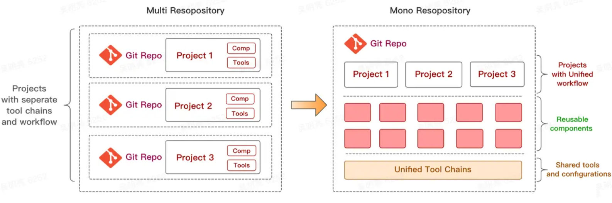

# 什么是 Monorepo

Monorepo 是一种将多个项目存放在同一个代码库中的开发策略。这些项目虽然有可能是相关的，但通常在逻辑上是独立的，并由不同的团队维护。

Monorepo 有时被称为单体代码库（monolithic repositories），但不应该与单体架构（monolithic architecture）相混淆，单体架构是一种用于编写自包含应用程序的软件开发实践。这方面的一个例子就是 Ruby on Rails，它可以处理 Web、API 和后端工作。

# Monorepo 和 Monolith repository 区别

Monolith repository 结构的项目，整个就是铁板一块，里面的每个部分脱离了这个项目都无法工作，而组成 Monorepo 的项目，或者说功能块，则是像积木一样，有自己的输入和输出，即使我们把它单独择出来，他也能过的很好，完全能自给自足，实现自己的功能。

如果要形象一点的比喻，可以这么说：

Monolith repository 里面的每个功能模块，就像是榫卯结构的部件，只有和他完全匹配的场景才能使用。

而 Monorepo 里面的每个功能模块，则是像我们玩的乐高积木一样，有标准的接口，即使从这个项目中拆离出去，也能使用。

# Monorepo的优缺点

现有的 Monorepo 框架虽然各有差异，但总体来说，都有以下的优缺点：

## 优点

1. 代码复用非常简单

   在 Monorepo 中，由于我们所有的代码都在同一个项目下，如果我们需要引用其他一些已经定义过的功能模块，会非常方便。我们只需要将复用频率高的代码，单独抽离出来成为一个 shared 之类的项目，那么其他所有的项目都只需要直接引用这个项目下的代码就可以了。而不用将这个项目重新打包，再在其他项目中使用；

2. 简化依赖管理

   由于我们是在同一个项目下，因此对于第三方依赖的管理也会简化很多，像是之前多个项目可能有一些相同的第三方依赖包，每个项目都需要下载一遍，而我们使用 Monorepo 的框架重构项目之后，这些依赖包就可以避免重复下载，同时也能通过配置在不同的项目之间复用；

3. 原子提交能让重构全局特性更容易

   当我们的一个库会影响到很多个项目时，修改了这个库之后，以往我们需要一个一个去更新对应受到影响的项目，进行相应的兼容适配工作，而修改一个问题又可能导致另外一个兼容问题；如果受影响的项目数量很大的话，简直是人间地狱。甚至即使你花了很大精力去更新，也不一定就能保证自己没有遗漏。而在 Monorepo 中，你的每次提交都会自动变更到受影响的项目中，也能通过编译时的错误检测机制，及时修正对应的代码，避免依赖兼容性问题的重复繁琐处理；

4. 跨组合作更方便

   由于 Monorepo 的项目是由一个一个独立的项目组成的，因此我们可以在每个子项目中使用自己的工作流和技术架构，即使你将几个跨端跨语言的项目都放在一起也完全可以。所以在跨组合作的情况下，通过同一个Monorepo来开发，能省去大量中间沟通和协作的花费；

5. 大影响范围的重构

   如果我们的某个功能代码---比如一个功能库---被很多个项目引用，按照多库开发的形式，我们就需要每个受到影响的项目都进行相应的更新，但是即使这样，也避免不了某个项目漏掉了处理，导致项目并没有完全统一，新的特性没有应用上。而 Monorepo 项目则是会即时将所有的变更应用到受影响的项目，确保最新的特性应用到了我们的项目中。

## 局限

1. 缺乏每个项目的权限控制

   Monorepo 由于将所有的子项目集成在同一个大的项目中，对于管理者来说，权限控制会变得很不方便，开发者每次拉取代码都会拉取所有的代码，无法进行精准的权限控制。不过现在部分主流 Monorepo 框架都进行了这方面的功能开发；

2. 版本信息杂糅不清晰

   同样由于所有功能都在同一个项目中，就会导致所有功能的修改都在同一个 git 下，不便于回溯和查找对应的历史记录；

3. 大项目在 Git 上表现很差

   代码增多之后，整个 git 项目会变得越来越大，开发者拉取代码的时间也会变得更长。不过针对这个问题，各家使用 Monorepo 的公司，要么自己开发了一套版本控制系统，要么针对现在的版本控制系统进行了优化；

4. 构建时间更长

   由于有很多个项目和功能模块，Monorepo 在构建时势必会花费更多的时间。而在这方面做的最好的应该是 Bazel，它特别针对超大型的 Monorepo 项目进行了构建优化。

总的来说，如果我们在开发过程中，需要跨组合作，或是希望有几个有互相引用关系的项目，能协同开发，但又希望保证每个项目的独立性，那就值得尝试 Monorepo。

# 框架对比

