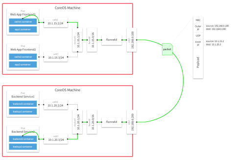
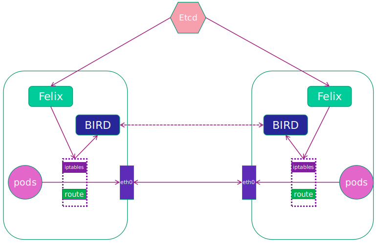
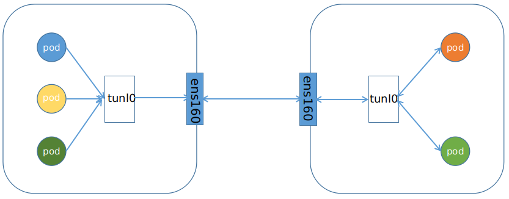

# k8s 网络

k8s 网络钟需要解决的通信问题包括如下几点：

- 容器间通信：同一个 pod 内的多个容器间的通信，通过 lo 即可实现；   

- pod 之间的通信： 同一节点的 pod 之间通过 cni 网桥转发数据包。( brctl show 可以查看) 不同节点的 pod 之间的通信需要网络插件支持；
- pod 和 service 通信: 通过 iptables 或 ipvs 实现通信，ipvs 取代不了 iptables，因为 ipvs 只能做负载均衡，而做不了 nat 转换；
- pod 和外网通信：iptables 的 masquerade；
- service 与集群外部客户端的通信: ingress、nodeport、loadbalancer。

## 网络策略

### 前置条件

网络策略通过网络插件来实现。要使用网络策略，你必须使用支持 NetworkPolicy 的网络解决方案。 创建一个 NetworkPolicy 资源对象而没有控制器来使它生效的话，是没有任何作用的。( Flannel 不支持 NetworkPolicy，所以使用 Flannel 网络插件是不会隔离pod的)

### 隔离和非隔离的 pod

默认情况下，pod 是非隔离的，它们接受任何来源的流量。pod 在被某 NetworkPolicy 选中时进入被隔离状态。 一旦名字空间中有 NetworkPolicy 选择了特定的 pod，该 pod 会拒绝该 NetworkPolicy 所不允许的连接。 （名字空间下其他未被 NetworkPolicy 所选择的 pod 会继续接受所有的流量）
网络策略不会冲突，它们是累积的。 如果任何一个或多个策略选择了一个 pod, 则该 pod 受限于这些策略的 入站（Ingress）/出站（Egress）规则的并集。因此评估的顺序并不会影响策略的结果。为了允许两个 pods 之间的网络数据流，源端 pod 上的出站（Egress）规则和 目标端 pod 上的入站（Ingress）规则都需要允许该流量。 如果源端的出站（Egress）规则或目标端的入站（Ingress）规则拒绝该流量， 则流量将被拒绝。

## service 和 iptables

service 的代理是 kube-proxy，kube-proxy 运行在所有节点上，它监听 apiserver 中 service 和 endpoint 的变化情况，创建路由规则以提供服务 ip 和负载均衡功能。简单理解此进程是 service 的透明代理兼负载均衡器，其核心功能是将到某个 service 的访问请求转发到后端的多个 pod 实例上，而 kube-proxy 底层又是通过 iptables 和 ipvs 实现的。

### iptables 原理

Kubernetes 从1.2版本开始，将 iptables 作为 kube-proxy 的默认模式。iptables 模式下的 kube-proxy 不再起到 proxy 的作用，其核心功能：通过 api server 的 watch 接口实时跟踪 service 与 endpoint 的变更信息，并更新对应的 iptables 规则，client 的请求流量则通过 iptables 的 NAT 机制 “直接路由” 到目标 pod。

### ipvs 原理

ipvs 在 Kubernetes1.11 中升级为 GA 稳定版。ipvs 则专门用于高性能负载均衡，并使用更高效的数据结构，允许几乎无限的规模扩张，因此被 kube-proxy 采纳为最新模式。

在 ipvs 模式下，使用 iptables 的扩展 ipset，而不是直接调用 iptables 来生成规则链。iptables 规则链是一个线性的数据结构，ipset 则引入了带索引的数据结构，因此当规则很多时，也可以很高效地查找和匹配。

可以将 ipset 简单理解为一个 ip 段的集合，这个集合的内容可以是 ip 地址、ip 网段、端口等，iptables 可以直接添加规则对这个“可变的集合”进行操作，这样做的好处在于可以大大减少 iptables 规则的数量，从而减少性能损耗。

### ipvs 和 iptables 的异同

iptables 与 ipvs 都是基于 Netfilter 实现的，但因为定位不同，二者有着本质的差别：iptables 是为防火墙而设计的；ipvs 则专门用于高性能负载均衡，并使用更高效的数据结构，允许几乎无限的规模扩张。

与 iptables 相比，ipvs 拥有以下明显优势：

- 为大型集群提供了更好的可扩展性和性能；
- 支持比 iptables 更复杂的复制均衡算法(最小负载、最少连接、加权等)；
- 支持服务器健康检查和连接重试等功能；
- 可以动态修改 ipset 的集合，即使 iptables 的规则正在使用这个集合。

# CNI 是什么

抽象的接口层，将容器网络配置方案与容器平台方案解耦。CNI（Container Network Interface）就是这样的一个接口层，它定义了一套接口标准，提供了规范文档以及一些标准实现。采用 CNI 规范来设置容器网络的容器平台不需要关注网络的设置的细节，只需要按 CNI 规范来调用 CNI 接口即可实现网络的设置。

# CNI 插件

k8s 通过 CNI 接口接入其他插件来实现网络通讯。目前比较流行的插件有 Flannel，Calico 等。

CNI 插件存放位置：`cat /etc/cni/net.d/10-flannel.conflist `。

## Flannel

### 介绍

Flannel 是 CoreOS 团队针对 Kubernetes 设计的一个网络规划服务，简单来说，它的功能是让集群中的不同节点主机创建的 Docker 容器都具有全集群唯一的虚拟 IP 地址。
Flannel 的设计目的就是为集群中的所有节点重新规划 IP 地址的使用规则，从而使得不同节点上的容器能够获得“同属一个内网”且”不重复的” IP 地址，并让属于不同节点上的容器能够直接通过内网 IP 通信。
Flannel 实质上是一种“覆盖网络(overlaynetwork)”，也就是将 TCP 数据包装在另一种网络包里面进行路由转发和通信，目前已经支持udp、vxlan、host-gw、aws-vpc、gce 和 alloc 路由等数据转发方式，默认的节点间数据通信方式是 UDP 转发。

### 特点

- 使集群中的不同 Node 主机创建的 Docker 容器都具有全集群唯一的虚拟 IP 地址；

- 建立一个覆盖网络（overlay network），通过这个覆盖网络，将数据包原封不动的传递到目标容器。覆盖网络是建立在另一个网络之上并由其基础设施支持的虚拟网络。覆盖网络通过将一个分组封装在另一个分组内来将网络服务与底层基础设施分离。在将封装的数据包转发到端点后，将其解封装；

- 创建一个新的虚拟网卡 flannel0 接收 docker 网桥的数据，通过维护路由表，对接收到的数据进行封包和转发(vxlan)；；

- etcd 保证了所有 node 上 flanned 所看到的配置是一致的。同时每个 node 上的 flanned 监听 etcd 上的数据变化，实时感知集群中node 的变化。

### 架构原理

#### 组件

- cni0：网桥设备，每创建一个 pod 都会创建一对 veth pair。其中一端是 pod 中的 eth0，另一端是 cni0 网桥中的端口（网卡）。pod 中从网卡 eth0 发出的流量都会发送到 cni0 网桥设备的端口（网卡）上；
- flannel.1：overlay 网络的设备，用来进行 vxlan 报文的处理（封包和解包）。不同 node 之间的 pod 数据流量都从 overlay 设备以隧道的形式发送到对端；
- flanneld：flannel 在每个主机中运行 flanneld 作为 agent，它会为所在主机从集群的网络地址空间中，获取一个小的网段 subnet，本主机内所有容器的 ip 地址都将从中分配。同时 flanneld 监听 k8s 集群数据库，为 flannel.1 设备提供封装数据时必要的 mac，ip等网络数据信息。

不同 node上 的 pod 的通信流程：

1. pod 中产生数据，根据pod的路由信息，将数据发送到 cni0；
2. cni0 根据节点的路由表，将数据发送到隧道设备 flannel.1；
3. flannel.1 查看数据包的目的 ip，从 flanneld 获得对端隧道设备的必要信息，封装数据包；
4. flannel.1 将数据包发送到对端设备。对端节点的网卡接收到数据包，发现数据包为 overlay 数据包，解开外层封装，并发送内层封装到 flannel.1 设备；
5. flannel.1 设备查看数据包，根据路由表匹配，将数据发送给 cni0 设备；
6. cni0 匹配路由表，发送数据给网桥上对应的端口。

### 数据转发方式

#### hostgw

hostgw 是最简单的 backend，它的原理非常简单，直接添加路由，将目的主机当做网关，直接路由原始封包。
优点：简单，直接，效率高。
缺点：要求所有的 pod 都在一个子网中，如果跨网段就无法通信。

#### udp

如何应对 pod 不在一个子网里的场景呢？将 pod 的网络包作为一个应用层的数据包，使用 udp 封装之后在集群里传输，即 overlay。

当容器 10.1.15.2/24 要和容器 10.1.20.2/24 通信时，流程如下：

1. 因为该封包的目的地不在本主机 subnet 内，因此封包会首先通过网桥转发到主机中；
2. 在主机上经过路由匹配，进入网卡 flannel.1；(需要注意的是 flannel.1 是一个 tun 设备，它是一种工作在三层的虚拟网络设备，而flanneld 是一个 proxy，它会监听 flannel.1 并转发流量)
3. 当封包进入 flannel.1 时，flanneld 就可以从 flanne.1 中将封包读出，由于 flanne.1 是三层设备，所以读出的封包仅仅包含 ip 层的报头及其负载；
4. 最后 flanneld 会将获取的封包作为负载数据，通过 udp socket 发往目的主机；
5. 在目的主机的 flanneld 会监听 public ip 所在的设备，从中读取 udp 封包的负载，并将其放入 flannel.1 设备内；
6. 容器网络封包到达目的主机，之后就可以通过网桥转发到目的容器了。

**优点**：pod 能够跨网段访问
**缺点**：隔离性不够，udp不能隔离两个网段。

#### vxlan

vxlan 和上文提到的 udp backend 的封包结构是非常类似的，不同之处是多了一个 vxlan header，以及原始报文中多了个二层的报头。

当初始化集群里，vxlan 网络的初始化工作：主机 B 加入 flannel 网络时,它会将自己的三个信息写入 etcd 中，分别是：subnet 10.1.16.0/24、public ip 192.168.0.101、vtep 设备 flannel.1 的 mac 地址 MAC B。之后，主机 A 会得到 EventAdded 事件，并从中获取上文中B添加至 etcd 的各种信息。

这个时候，它会在本机上添加三条信息：

1. 路由信息：所有通往目的地址 10.1.16.0/24 的封包都通过 vtep 设备 flannel.1 设备发出，发往的网关地址为 10.1.16.0，即主机 B 中的 flannel.1 设备；
2. fdb 信息：MAC 地址为 MAC B 的封包，都将通过 vxlan 发往目的地址 192.168.0.101，即主机 B；
3. arp 信息：网关地址 10.1.16.0 的地址为 MAC B。

事实上，flannel 只使用了 vxlan 的部分功能，由于 VNI 被固定为 1，本质上工作方式和 udp backend 是类似的，区别无非是将 udp 的proxy 换成了内核中的 vxlan 处理模块。而原始负载由三层扩展到了二层，但是这对三层网络方案 flannel 是没有意义的，这么做也仅仅只是为了适配 vxlan 的模型。

### 总结

总的来说，flannel 更像是经典的桥接模式的扩展。我们知道，在桥接模式中，每台主机的容器都将使用一个默认的网段，容器与容器之间，主机与容器之间都能互相通信。要是，我们能手动配置每台主机的网段，使它们互不冲突。接着再想点办法，将目的地址为非本机容器的流量送到相应主机：如果集群的主机都在一个子网内，就搞一条路由转发过去；若是不在一个子网内，就搞一条隧道转发过去。这样以来，容器的跨网络通信问题就解决了。而 flannel 做的，其实就是将这些工作自动化了而已。

**不足**：

1. 不支持 pod 之间的网络隔离。Flannel 设计思想是将所有的 pod都放在一个大的二层网络中，所以 pod 之间没有隔离策略。
2. 设备复杂，效率不高。Flannel 模型下有三种设备，数量经过多种设备的封装、解析，势必会造成传输效率的下降。

## Calico

### 介绍

多数的虚拟化平台实现中，通常都使用二层隔离技术来实现容器的网络，这些二层的技术有一些弊端，比如需要依赖 VLAN、bridge 和隧道等技术，其中 bridge 带来了复杂性，vlan 隔离和 tunnel 隧道则消耗更多的资源并对物理环境有要求，随着网络规模的增大，整体会变得越加复杂。我们尝试把 host 当作 Internet 中的路由器，同样使用 BGP 同步路由，并使用 iptables 来做安全访问策略，最终设计出了 Calico 方案。

**适用场景**：k8s环境中的pod之间需要隔离

**设计思想**：Calico 不使用隧道或 NAT 来实现转发，而是巧妙的把所有二三层流量转换成三层流量，并通过 host 上路由配置完成跨 Host 转发。

**优势**：

1. 更优的资源利用
   二层网络通讯需要依赖广播消息机制，广播消息的开销与 host 的数量呈指数级增长，Calico 使用的三层路由方法，则完全抑制了二层广播，减少了资源开销。另外，二层网络使用 VLAN 隔离技术，天生有 4096 个规格限制，即便可以使用 vxlan 解决，但 vxlan 又带来了隧道开销的新问题。而 Calico 不使用 vlan 或 vxlan 技术，使资源利用率更高。
2. 可扩展性
   Calico 使用与 Internet 类似的方案，Internet 的网络比任何数据中心都大，Calico 同样天然具有可扩展性。
3. 简单而更容易 debug
   因为没有隧道，意味着 workloads 之间路径更短更简单，配置更少，在 host 上更容易进行 debug 调试。
4. 更少的依赖
   Calico 仅依赖三层路由可达。
5. 可适配性
   Calico 较少的依赖性使它能适配所有 VM、Container、白盒或者混合环境场景。

### 架构原理

#### 组件

1. Felix：运行在每一台 host 的 agent 进程，主要负责网络接口管理和监听、路由、ARP 管理、ACL 管理和同步、状态上报等；
2. etcd：分布式键值存储，主要负责网络元数据一致性，确保 Calico 网络状态的准确性，可以与 kubernetes 共用；
3. BGP Client（BIRD）：Calico 为每一台 Host 部署一个 BGP Client，使用 BIRD 实现，BIRD 是一个单独的持续发展的项目，实现了众多动态路由协议比如 BGP、OSPF、RIP 等。在 Calico 的角色是监听 Host 上由 Felix 注入的路由信息，然后通过 BGP 协议广播告诉剩余 host 节点，从而实现网络互通；
4. BGP Route Reflector：在大型网络规模中，如果仅仅使用 BGP client 形成 mesh 全网互联的方案就会导致规模限制，因为所有节点之间俩俩互联，需要 N^2 个连接，为了解决这个规模问题，可以采用 BGP 的 Router Reflector 的方法，使所有 BGP Client 仅与特定 RR 节点互联并做路由同步，从而大大减少连接数。

Felix 会监听 etcd 中心的存储，从它获取事件，比如说用户在这台机器上加了一个 ip，或者是创建了一个容器等。用户创建 pod 后，Felix 负责将其网卡、ip、MAC 都设置好，然后在内核的路由表里面写一条，注明这个 ip 应该到这张网卡。同样如果用户制定了隔离策略，Felix 同样会将该策略创建到 ACL 中，以实现隔离。

BIRD 是一个标准的路由程序，它会从内核里面获取哪一些 ip 的路由发生了变化，然后通过标准 BGP 的路由协议扩散到整个其他的宿主机上，让外界都知道这个 ip 在这里，你们路由的时候得到这里来。

#### 特点

由于 Calico 是一种纯三层的实现，因此可以避免与二层方案相关的数据包封装的操作，中间没有任何的 NAT，没有任何的 overlay**，**所以它的转发效率可能是所有方案中最高的，因为它的包直接走原生 TCP/IP 的协议栈，它的隔离也因为这个栈而变得好做。因为 TCP/IP 的协议栈提供了一整套的防火墙的规则，所以它可以通过 iptables 的规则达到比较复杂的隔离逻辑。

### 数据转发方式

#### IPIP

从字面来理解，就是把一个 ip 数据包又套在一个 ip 包里，即把 ip 层封装到  ip 层的一个 tunnel。它的作用其实基本上就相当于一个基于 ip 层的网桥！一般来说，普通的网桥是基于 mac 层的，根本不需 ip ，而这个 ipip 则是通过两端的路由做一个 tunnel，把两个本来不通的网络通过点对点连接起来。

#### BGP

边界网关协议（Border Gateway Protocol, BGP）是互联网上一个核心的去中心化自治路由协议。它通过维护IP路由表或‘前缀’表来实现自治系统（AS）之间的可达性，属于矢量路由协议。BGP不使用传统的内部网关协议（IGP）的指标，而使用基于路径、网络策略或规则集来决定路由。因此，它更适合被称为矢量性协议，而不是路由协议。BGP，通俗的讲就是讲接入到机房的多条线路（如电信、联通、移动等）融合为一体，实现多线单 IP，BGP 机房的优点：服务器只需要设置一个 ip 地址，最佳访问路由是由网络上的骨干路由器根据路由跳数与其它技术指标来确定的，不会占用服务器的任何系统。
在安装 calico 网络时，默认安装是IPIP网络。calico.yaml 文件中，将 CALICO_IPV4POOL_IPIP 的值修改成 "off"，就能够替换成 BGP 网络。
BGP 网络相比较 IPIP 网络，最大的不同之处就是没有了隧道设备 tunl0。 前面介绍过 IPIP 网络 pod 之间的流量发送 tunl0，然后 tunl0发送对端设备。BGP 网络中，pod 之间的流量直接从网卡发送目的地，减少了 tunl0 这个环节。

**IPIP网络**：

> 流量：tunlo 设备封装数据，形成隧道，承载流量。
> 适用网络类型：适用于互相访问的 pod 不在同一个网段中，跨网段访问的场景。外层封装的 ip 能够解决跨网段的路由问题。
> 效率：流量需要 tunl0 设备封装，效率略低

**BGP网络**：

> 流量：使用路由信息导向流量
> 适用网络类型：适用于互相访问的 pod 在同一个网段，适用于大型网络。
> 效率：原生 hostGW，效率高

### Calico 不足问题

> (1) 缺点租户隔离问题
> Calico 的三层方案是直接在 host 上进行路由寻址，那么对于多租户如果使用同一个 CIDR 网络就面临着地址冲突的问题。
> (2) 路由规模问题
> 通过路由规则可以看出，路由规模和 pod 分布有关，如果 pod离散分布在 host 集群中，势必会产生较多的路由项。
> (3) iptables 规则规模问题
> 1台 Host 上可能虚拟化十几或几十个容器实例，过多的 iptables 规则造成复杂性和不可调试性，同时也存在性能损耗。
> (4) 跨子网时的网关路由问题
> 当对端网络不为二层可达时，需要通过三层路由机时，需要网关支持自定义路由配置，即 pod 的目的地址为本网段的网关地址，再由网关进行跨三层转发。

# 参考链接

[1]: https://blog.csdn.net/Gong_yz/article/details/129483025	"k8s 网络策略和网络插件"
[2]: https://blog.csdn.net/justlpf/article/details/129196788	"Flannel/Calico对比"
[3]: https://zhuanlan.zhihu.com/p/550373285	"深入剖析Kubernetes"

