# 概述

## Docker 是什么

Docker 是一个开源项目，诞生于 2013 年初，它基于 Google 公司推出的 Go 语言实现。项目后来加入了 Linux 基金会，遵从了 Apache 2.0 协议，项目代码在 GitHub 上进行维护。

Docker 是基于 linux 内核实现，Docker 最早采用 LXC 技术，LXC 是 Linux 原生支持的容器技术，可以提供轻量级的虚拟化 ，后来 Docker 改为自己研发并开源的 runc 技术运行容器，彻底抛弃了 LXC 。

Docker 相比虚拟机的交付速度更快，资源消耗更低，Docker 采用客户端/服务端架构，使用远程 API 来管理和创建容器，其可以轻松的创建一个轻量级的、可移植的、自给自足的容器，Docker 遵从 apache 2.0 协议，并通过（namespace 及 cgroup 等）来提供容器的资源隔离与安全保障等，所以 docker 容器在运行时不需要类似虚拟机（空运行的虚拟机占用物理机6-8%性能）的额外资源开销，因此可以大幅提高资源利用率。


## Docker 组成

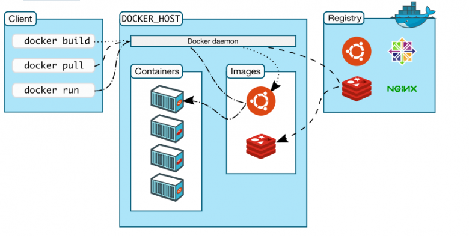

- Docker 主机(Host)：一个物理机或虚拟机，用于运行 docker 服务进程和容器，也称为宿主机，node 节点；
- Docker 服务端(Server)：docker 守护进程，运行 docker 容器；
- Docker 客户端(Client)：客户端使用 docker 命令或其他工具调用 docker API；
- Docker 仓库(Registry): 保存镜像的仓库，可以使用[官方仓库](https://hub.docker.com/)，也可以搭建私有仓库 Harbor；
- Docker 镜像(Images)：镜像可以理解为创建实例使用的模板；
- Docker 容器(Container): 容器是从镜像生成对外提供服务的一个或一组服务。

## Docker 与虚拟机和物理机的区别

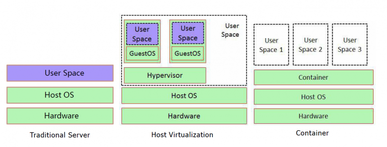


- 资源利用率更高：一台物理机可以运行数百个容器，但是一般只能运行数十个虚拟机；
- 开销更小：不需要启动单独的虚拟机 OS 内核占用硬件资源；
- 启动速度更快：可以在数秒内完成启动；
- 集成性更好：和 CI/CD（持续集成/持续部署）相关技术结合性更好，实现自动化管理。

# 原理

## Docker 架构

Docker 是一个 C/S 模式的架构，后端是一个松耦合架构，众多模块各司其职。

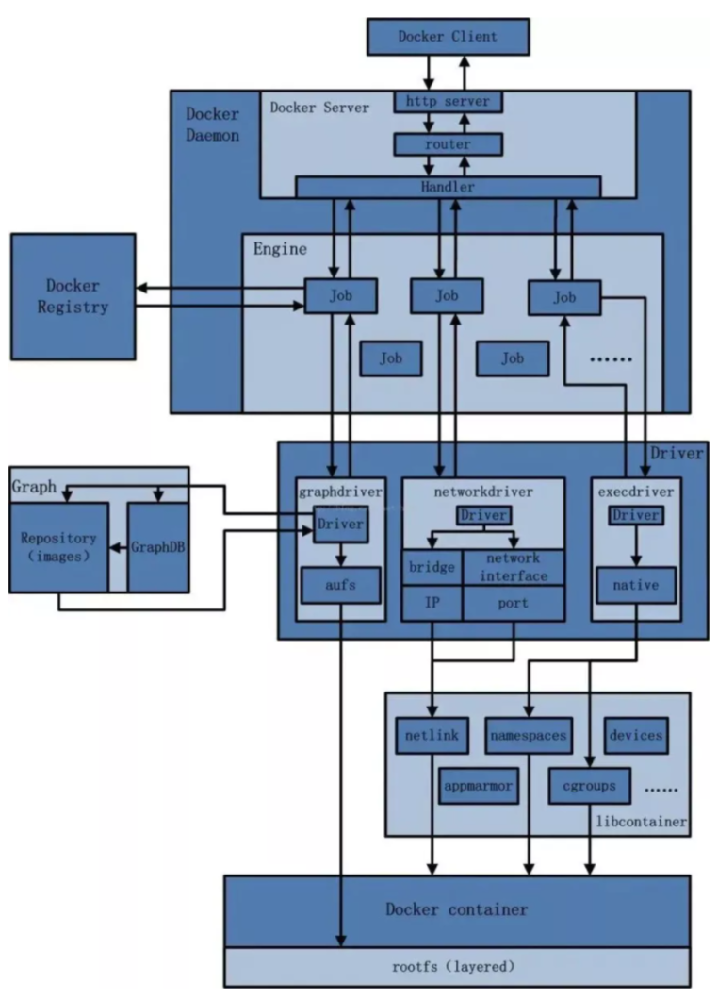

## Docker 运行流程

Docker 运行的基本流程：

1. 用户使用 Docker Client 与 Docker Daemon 建立通信，并发送请求给后者；
2. Docker Daemon 作为 Docker 架构中的主体部分，首先提供 Docker Server 的功能使其可以接受 Docker Client 的请求；
3. Docker Engine 执行 Docker 内部的一系列工作，每一项工作都是以一个 Job 的形式的存在；
4. Job 的运行过程中，当需要容器镜像时，则从 Docker Registry 中下载镜像，并通过镜像管理驱动 Graph Driver 将下载镜像以 Graph 的形式存储；
5. 当需要为 Docker 创建网络环境时，通过网络管理驱动 Network Driver 创建并配置 Docker 容器网络环境；
6. 当需要限制 Docker 容器运行只有或执行用户指令等操作时，则通过 Exec Driver 来完成；
7. Libcontainer 是一项独立的容器管理包，Network Driver 以及 Exec Driver 都是通过 Libcontainer 来实现具体对容器进行的操作。

## Docker 存储引擎

- AUFS：（AnotherUnionFS）是一种 Union FS ，是文件级的存储驱动。所谓 UnionFS 就是把不同物理位置的目录合并 mount 到同一个目录中。简单来说就是支持将不同目录挂载到一个虚拟文件系统下的。这种可以层层地叠加修改文件。无论底下有多少都是只读的，最上系统可写的。当需要修改一个文件时， AUFS 创建该文件的一个副本，使用 CoW 将文件从只读层复制到可写进行修改，结果也保存在 Docker 中，底下的只读层就是 image，可写层就是 Container，是 Docker 18.06 及更早版本的首选存储驱动程序，在内核 3.13 上运行 Ubuntu 14.04 时不支持 overlay2；
- Overlay：一种 Union FS 文件系统， Linux 内核 3.18 后支持；
- Overlay2: Overlay 的升级版，到目前为止，所有 Linux 发行版推荐使用的存储类型，也是 Docker 默认使用的存储引擎为 overlay2，需要磁盘分区支持 d-type 功能，因此需要系统磁盘的额外支持；
- Devicemapper：因为早期 CentOS 和 RHEL 版本内核版本不支持 overlay2，默认使用的存储驱动程序，最大数据容量只支持100GB且性能不佳，当前较新版本的 CentOS 已经支持 overlay2， 因此推荐使用overlay2；
- ZFS(Sun -2005)/btrfs(Oracle-2007)：目前没有广泛使用；

Docker官方推荐首选存储引擎为 overlay2。

## Docker 服务进程

Docker有四个进程：

- dockerd：被 client 直接访问，其父进程为宿主机的 systemd 守护进程；
- docker-proxy：每个进程 docker-proxy 实现对应一个需要网络通信的容器，管理宿主机和容器的之间端口映射，其父进程为 dockerd，如果容器不需要网络则无需启动；
- containerd：被 dockerd 进程调用以实现与 runc 交互；
- containerd-shim：真正运行容器的载体，每个容器对应一个 containerd-shim 进程，其父进程为containerd。

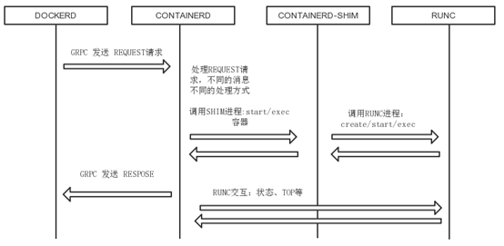

1. dockerd 通过 grpc 和 containerd 模块通信，dockerd 由 libcontainerd 负责和 containerd 进行交换，dockerd 和 containerd 通信 socket 文件：/run/containerd/containerd.sock；
2. containerd 在 dockerd 启动时被启动，然后 containerd 启动 grpc 请求监听，containerd 处理 grpc 请求，根据请求做相应动作；
3. 若是 start 或是 exec 容器，containerd 拉起一个 container-shim , 并进行相应的操作；
4. container-shim 被拉起后，start/exec/create 拉起 runC 进程，通过 exit、control 文件和 containerd 通信，通过父子进程关系和 SIGCHLD 监控容器中进程状态；
5. 在整个容器生命周期中，containerd 通过 epoll 监控容器文件，监控容器事件。

## Docker 镜像管理

镜像，即创建容器的模版，是一种轻量级、可执行的独立软件包，它包含运行某个软件所需的所有内容，我们把应用程序和配置依赖打包好形成一个可交付的运行环境（包括代码、运行时需要的库、环境变量和配置文件等），这个打包好的运行环境就是镜像文件。

镜像含里面是一层层的文件系统,叫做 Union FS（联合文件系统），联合文件系统可以将几层目录挂载到一起，形成一个虚拟文件系统，虚拟文件系统的目录结构就像普通 Linux 的目录结构一样，镜像通过这些文件再加上宿主机的内核共同提供了一个 Linux 的虚拟环境，每一层文件系统叫做一层 Layer，联合文件系统可以对每一层文件系统设置三种权限，只读（readonly）、读写（readwrite）和写出（whiteout-able），但是镜像中每一层文件系统都是只读的,构建镜像的时候，从一个最基本的操作系统开始，每个构建提交的操作都相当于做一层的修改，增加了一层文件系统，一层层往上叠加，上层的修改会覆盖底层该位置的可见性，这也很容易理解，就像上层把底层遮住了一样，当使用镜像的时候，我们只会看到一个完全的整体，不知道里面有几层也不需要知道里面有几层，结构图如下：

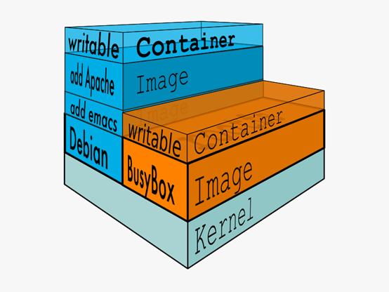

一个典型的 Linux 文件系统由 bootfs 和 rootfs 两部分组成，bootfs(boot file system) 主要包含 bootloader 和kernel，bootloader 主要用于引导加载 kernel，当 kernel 被加载到内存中后 bootfs 会被 umount 掉，rootfs (root file system) 包含的就是典型 Linux 系统中的 /dev，/proc，/bin，/etc 等标准目录和文件，下图就是镜像中最基础的两层结构，不同的 Linux 发行版（如 Ubuntu 和 CentOS ) 在 rootfs 这一层会有所区别。

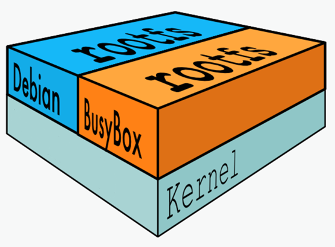

一般的镜像通常都比较小，官方提供的 Ubuntu 镜像只有60MB多点，而 CentOS 基础镜像也只有200MB左右，一些其他版本的镜像甚至只有几MB，比如：busybox 才1.22MB，alpine 镜像也只有5M左右。镜像直接调用宿主机的内核，镜像中只提供 rootfs，也就是只需要包括最基本的命令、工具和程序库就可以了。

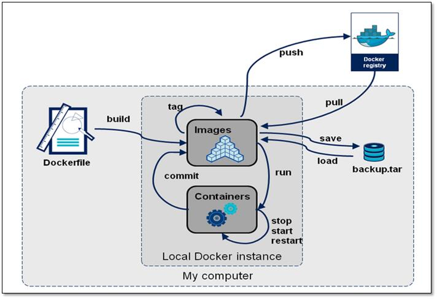

## Docker 数据管理

如果将正在运行中的容器修改生成了新的数据，或者修改了现有的一个已经存在的文件内容，那么新产生的数据将会被复制到读写层，进行持久化保存，这个读写层也就是容器的工作目录，此即“写时复制(COW) copy on write”机制。

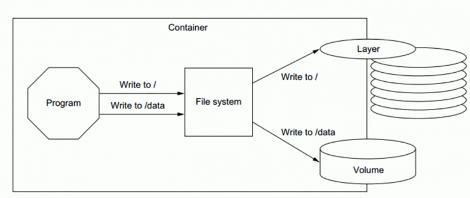

## Docker 容器的分层

Docker 镜像是分层设计的，镜像层是只读的，通过镜像启动的容器添加了一层可读写的文件系统，用户写入的数据都保存在这一层中。

容器的数据分层：

- LowerDir：image 镜像层(镜像本身，只读)；
- UpperDir：容器的上层(读写)；
- MergedDir：容器的文件系统，使用 Union FS（联合文件系统）将 lowerdir 和 upperdir 合并给容器使用；
- WorkDir：容器在 宿主机的工作目录。

```shell
# 查看指定容器数据分层
docker inspect <镜像ID> | grep "GraphDriver"
```

### 数据卷

卷就是目录或文件，存在于一个或多个容器中，由于挂载到容器，但不属于联合文件系统，因此能够提供和持续存储或共享数据特性。卷设计的目的就是数据持久化，完全独立于容器的生命周期，因此 Docker 不会再容器删除时删除其挂载的数据卷。

特点：

- 数据卷是目录或者文件，并且可以在多个容器之间共同使用；
- 对数据卷更改的数据在所有容器里面会立即更新；
- 数据卷的数据可以持久保存，即使删除使用使用该容器卷的容器也不影响，数据卷的生命周期一直持续到没有容器使用它为止；
- 在容器里面的写入数据不会影响到镜像本身；
- 依赖于宿主机目录，宿主机出问题，上面容器会受影响，当宿主机较多时，不方便统一管理。

```shell
# 容器数据卷挂载
docker run -it -v <宿主机绝对路径>:<容器内路径>[:ro] <镜像名称>

# 容器数据卷继承
docker run -it --volumes-from <数据卷名称> <镜像名称>
```

## Docker 网络管理

### Docker 默认网络设置

1. Docker 服务安装完成之后，默认在每个宿主机会生成一个名称为 docker0 的网卡其 IP 地址都是172.17.0.1/16；
2. 每次新建容器后，宿主机多了一个虚拟网卡，和容器的网卡组合成一个网卡，比如：137:veth8ca6d43@if136，而在容器内的网卡名为136，可以看出和宿主机的网卡之间的关联并且容器会自动获取一个172.17.0.0/16网段的随机地址，默认从172.17.0.2开始，第二次容器为172.17.0.3，以此类推。

### Docker 容器间通信

默认情况下

- 同一个宿主机的不同容器之间可以相互通信；
- 不同宿主机之间的容器IP地址重复，不能相互通信。

#### 同主机容器间通过名称通信

同一个宿主机上的容器之间可以通过自定义的容器名称相互访问，通过 --link 实现。

```shell
docker run --link <目标容器ID或容器名称>  <容器名称>
```

#### 跨主机容器间通信

跨主机互联是说 A 宿主机的容器可以访问 B 主机上的容器，但是前提是保证各宿主机之间的网络是可以相互通信的，然后各容器才可以通过宿主机访问到对方的容器。可以在宿主机做一个网络路由就可以实现 A宿主机的容器访问 B 主机的容器的目的，但此方式只适合小型网络环境，复杂的网络或者大型的网络可以通过各开源网络插件实现，如：flannel、calico。

#### Docker 网络模式

Docker 支持的5种网络模式：

- none：有独立的 Network namespace，但没有进行任何网络设置；
- bridge：为每个容器分配一个IP，并将容器连接到 docker0；
- host：容器不会虚拟自己的网卡、配置自己的 IP 而是使用宿主机的ip和端口；
- container：和指定容器共享 IP 和端口；
- network-name：自定义网络。

默认新建的容器使用 bridge 模式，创建容器时，可以指定网络模式。

```shell
docker run --network <模式>
```

##### Bridge 模式

bridge 模式是 docker 的默认模式，即不指定任何模式就是 bridge 模式，也是使用比较多的模式，此模式创建的容器会为每一个容器分配自己的网络 IP 等信息，并将容器连接到一个虚拟网桥与外界通信。

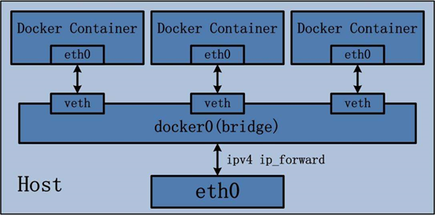

可以和外部网络之间进行通信，通过 SNAT 访问外网，使用 DNAT 可以入容器被外部主机访问，所以此模式也称为 NAT 模式。此模式，宿主机的需要启动 ip_forward 功能。

特点：

- 网络资源隔离：不同宿主机的容器无法直接通信，各自使用独立风络；
- 无需手动配置：容器默认自动获取172.17.0.0/16的 IP 地址，此地址可以修改；
- 可访问外网：利用宿主机的物理网卡，SNAT 连接外网；
- 外部主机无法直接访问容器：可以通过配置 DNAT 接受外网的访问；
- 低性能较低：因为可通过 NAT，网络转换带来更的损耗；
- 端口管理繁琐：每个容器必须手动指定唯一的端口，容器产生端口冲容。

##### Host 模式

启动的容器如果指定 host 模式，那么新创建的容器不会创建自己的虚拟网卡，而是直接使用宿主机的网卡和 ip 地址，因此在容器里面查看到的 ip 信息就是宿主机的信息，访问容器的时候直接使用宿主机 ip 加容器端口即可，不过容器内除网络以外的其它资源，如：文件系统、系统进程等仍然和宿主机保持隔离。

此模式由于直接使用宿主机的网络无需转换，网络性能最高，但是各容器之间端口不能相同，适用于运行容器端口比较固定的业务。

特点：

- 共享宿主机网络；
- 网络性能无损耗；
- 网络故障排除相对简单；
- 各容器网络无隔离；
- 网络资源无法分别统计；
- 端口管理困难：容易产生端口冲突；
- 不支持端口映射。

##### None 模式

在使用 none 模式后，Docker 容器不会进行任何网络配置，没有网卡、没有 ip 也没有路由，因此默认无法与外界通信，需要手动添加网卡配置 ip 等，所以极少使用。

##### Container 模式

使用此模式创建的容器需指定和一个已经存在的容器共享一个网络，而不是和宿主机共享网，新创建的容器不会创建自己的网卡也不会配置自己的 ip，而是和一个已经存在的被指定的容器共享 ip 和端口范围，因此这个容器的端口不能和被指定的端口冲突，除了网络之外的文件系统、进程信息等仍然保持相互隔离，两个容器的进程可以通过 lo 网卡保持通信。

特点：

- 与宿主机风络空间隔离；
- 空器间共享网络空间；
- 适合频繁的容器间的网络通信；
- 直接使用对方的网络，较少使用。

##### 自定义网络模式

```shell
# 创建自定义网络
docker network create -d <模式> --subnet <网段> --gateway <网关> <自定义网络名称>

# 查看自定义网络信息
docker network inspect <自定义网络名称|网络ID>

# 引用自定义网络
docker run --network  <自定义网络名称> <镜像名称>

# 删除自定义网络
doccker network rm <自定义网络名称|网络ID>
```

# 基础

## Docker 安装

Docker 安装方法参考[官方安装指导](https://docs.docker.com/engine/install)，此处不再赘述。

## Docker 常用命令

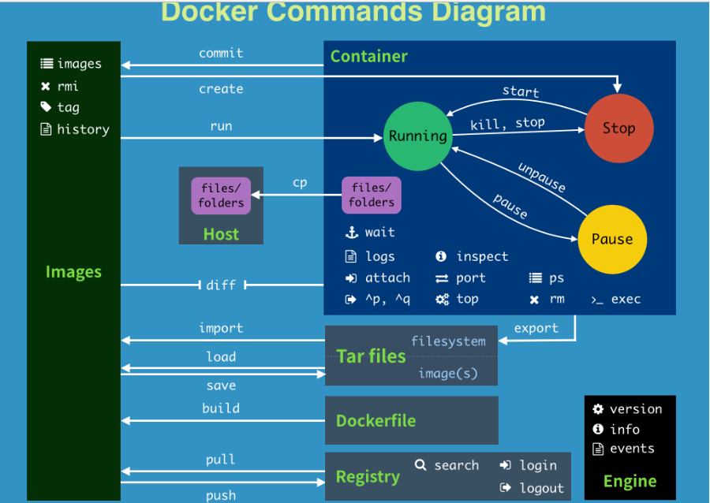

### 镜像命令

- docker images：查看本地主机上的镜像

  语法：`docker images [选项] [仓库名称[:TAG]]`

  选项：

  ​	-a	列出所有镜像

  ​	-q	只打印镜像的ID

- docker pull：下载镜像到本地

  语法：`docker pull [选项] <镜像名称>[:TAG]` # 不指定TAG，默认为latest

- docker rmi：删除镜像

  语法：`docker rmi [选项] <镜像ID|镜像名称> [<镜像ID|镜像名称>...]`

  选项：

  ​	-f	强制删除镜像

  ```shell
  # 根据镜像名删除镜像
  docker rmi <镜像名称>[:TAG]
  
  # 根据镜像ID删除
  docker rmi <镜像ID>
  
  # 强制删除镜像（如果容器已经启动则需先停止后方可删除）
  docker rmi -f <镜像ID>
  
  # 批量删除所有镜像
  docker rmi -f $(docker images -aq)
  
  # 删除悬浮镜像（TAG值为<none>）
  docker rmi $(docker images -f "dangling=true" -q --no-trunc)
  
  # 删除48小时之前的镜像
  docker image prune -a --force --filter "until=48h"
  
  # 查找镜像被哪些镜像引用了
  docker image inspect --format='{{.RepoTags}} {{.Id}} {{.Parent}}' $(docker image ls -q --filter since=IMAGE_ID)
  ```

  注：docker的虚悬镜像是什么？仓库名、标签都是<none>的镜像，俗称虚悬镜像（dangling image）。

- docker build：构建镜像

  语法：`docker build [选项] <上下文路径>`

  选项：

  ​	-f	指定Dockerfile文件，不指定默认为当前路径的Dockerfile

  ​	-t	指定新生成的镜像名:TAG

  注：构建镜像的上下文，通常使用点 (.)表示在当前路径。

  ```shell
  # 常规使用
  docker build -t <镜像名称>[:TAG] .
  
  # 构建时拉取最新镜像
  # 可以确保 Docker 在构建镜像之前拉取你的 Dockerfile 中 FROM 语句中提到的镜像的更新
  docker build --pull -t <镜像名称>[:TAG] .
  ```

- docker login：登录镜像仓库

  语法：`docker login [选项] [仓库地址]`

  选项：

  ​	-u	用户名

  ​	-p	密码

- docker tag：设置镜像TAG

  语法：`docker tag <原镜像名称>[:TAG] <目标镜像名称>[:TAG]`

- docker push：推送镜像

  语法：`docker push [选项] <镜像名称>[:TAG]`

- docker history：查看镜像分层

  语法：`docker history [选项] <镜像ID>`

  ```shell
  # 查看镜像分层信息
  docker history <镜像ID>
  
  # 查看镜像完整构建命令
  docker history --format {{.CreatedBy}} --no-trunc=true <镜像ID>
  ```

- docker inspect：查看镜像详细信息

  语法：`docker inspect [选项] <镜像ID|镜像名称> [<镜像ID|镜像名称>...]`

- docker search：搜索镜像

  语法：`docker search [选项] [镜像名称]`

  ```shell
  # 搜索镜像，默认从官方镜像仓库搜索
  docker search <镜像名称>
  ```

- docker save：镜像打包

  语法：`docker save [选项] <镜像名称> [<镜像名称>...]`

  ```shell
  # 把镜像打成一个tar包
  docker save <镜像名称> > <tar包名称>
  ```

- docker load：镜像导入

  语法：`docker load [选项]`

  ```shell
  # 导入镜像
  docker load -i <tar包名称>
  ```

- docker commit：提交镜像

  语法：`docker commit [选项] <容器名称|容器ID> [仓库名称[:TAG]]`

  选项：

  ​	-m	信息

  ​	-a	作者

### 容器命令

- docker ps：查看容器进程

  语法：`docker ps [选项]`

  选项：

  ​	-a	列出所有正在运行+历史运行过的容器

  ​	-l	显示最近创建的容器

  ​	-n	显示最近n个创建的容器

  ​	-q	静默模式，只显示容器编号

- docker logs：查看容器日志

  语法：`docker logs [选项] <容器名称|容器ID>`

  选项：

  ​	-f		动态查看

  ​	--tail n	显示最近n行

  ​	-t		显示时间戳

  ```shell
  # 查看指定时间后的日志，只显示最后100行：
  docker logs -f -t --since=“2018-02-08” --tail=100 <容器ID>
  
  # 查看最近30分钟的日志:
  docker logs --since 30m <容器ID>
  
  # 查看某时间之后的日志：
  docker logs -t --since=“2018-02-08T13:23:37” <容器ID>
  
  # 查看某时间段日志：
  docker logs -t --since="2018-02-08T13:23:37" --until="2018-02-09T12:23:37" <容器ID>
  ```

- docker run：运行容器

  语法：`docker run [选项] <镜像名称> [COMMAND] [ARG...]`

  选项：

  -i	即使未连接STDIN（标准输入）也保持打开状态，分配一个交互终端

  -t	表示容器启动后会进入其命令行，通常与-i一起使用，分配一个伪tty设备,支持终端登录

  -d	让容器在后台运行并打印容器的ID

  -v	设置容器卷绑定

  -w	指定工作目录

  -p	设置端口映射

  -e	设置容器内环境变量，在容器内可通过export查看

  --rm			容器推出后会被删除

  --name			容器命名

  --link			设置通过容器名访问

  --restart		容器退出时的策略

  --network		设置容器网络模式

  --hostname		设置容器主机名

  --shm-size		指定shm的大小，默认为64M

  --cpus=n -m xM 				设置容器CPU和内存使用上限

  --privileged=true				开启特权模式

  --dns 114.114.114.114			指定容器内的DNS

  --add-host	www.a.com:1.1.1.1	添加主机映射

  注：--privileged=true，这种模式下容器对docker宿主机拥有root访问权限，允许我们以其宿主机具有（几乎）所有能力来运行容器，包括一些内核特性和设备访问，慎用。

  ```shell
  docker run -itd --privileged=true --name test --hostname test \
  --restart unless-stopped --net=host  --cpus=1 -m 512M -v /tmp:/tmp \
  -w /opt -p 80:80  -e MYSQL_IP=192.168.1.1 \
  --device=/dev/uhid docker.io/nginx:latest
  ```

  注：Docker容器后台运行，就必须有一个前台进程。容器运行的命令如果不是那些一直挂起的命令（如top、tail），就会自动停止。

- docker rm：删除容器

  语法：`docker rm [选项] <容器名称|容器ID> [<容器名称|容器ID>...]`

  ```shell
  # 删除容器
  docker rm <容器名称|容器ID>
  
  #强制删除容器，可以删除运行中的容器
  docker rm -f <容器名称|容器ID>
  
  #删除容器的同时也删除与之关联的volume
  docker rm -v <容器名称|容器ID>
  
  # 一次性删除多个容器实例
  docker rm -f $(docker ps -a -q)
  docker ps -a -q | xargs docker rm
  ```

- docker exec：进入容器

  语法：`docker exec [选项] <容器名称|容器ID> <SHELL命令> [ARG...]`

  ```shell
  # 进入容器并以命令行交互
  docker exec -it <容器名称|容器ID> <SHELL命令>
  ```

- docker cp：容器内拷贝文件

  语法：`docker cp [选项] <容器名称|容器ID>:<容器内文件路径> <宿主机路径>`

  ​          `docker cp [选项] <宿主机文件路径> <容器名称|容器ID>:<容器内路径>`

  ```shell
  # 拷贝宿主机的hosts文件到容器的/opt目录下
  docker cp /etc/hosts <容器名称|容器ID>:/opt
  
  # 拷贝容器的a.sh文件到宿主机的/tmp路径下
  docker cp <容器名称|容器ID>:/opt/a.sh /tmp
  ```

- 容器启停命令

  ```shell
  # 启动容器
  docker start <容器名称|容器ID>
  
  # 重启容器
  docker restart <容器名称|容器ID>
  
  # 停止容器
  docker stop <容器名称|容器ID>
  
  # 强制停止容器
  docker kill <容器名称|容器ID>
  # 暂停容器
  docker pause <容器名称|容器ID>
  
  # 取消暂停容器
  docker unpause <容器名称|容器ID>
  
  # 退出容器
  # exit：run进去容器，exit退出，容器停止
  # ctrl+p+q：run进去容器，ctrl+p+q退出，容器不停止
  ```

- 容器状态查看命令

  ```shell
  # 查看容器里面的进程
  docker top <容器名称|容器ID>
  
  # 查看容器资源使用情况(不指定容器，会查看所有容器的使用情况)
  docker stats <容器名称|容器ID>
  
  # 查看容器元数据
  docker inspect <容器名称|容器ID>
  
  # 查看容器日志策略
  docker inspect -f '{{.HostConfig.LogConfig}}' <容器名称|容器ID>
  
  # 查看容器在宿主机对应的PID
  docker inspect --format "{{ .State.Pid }}" <容器名称|容器ID>
  ```

- 容器的导入导出

  ```shell
  # 导出容器为tar文件
  docker export <容器名称|容器ID> > <tar文件名称>
  
  # 导入tar文件为镜像
  cat <tar文件名称> | docker import - <仓库名称>/<镜像名称>:TAG
  ```

### 其他命令

- 管理类命令

  ```shell
  # 启动Docker
  systemctl start docker
  
  # 停止Docker
  systemctl stop docker
  
  # 重启Docker
  systemctl restart docker
  
  # 查看Docker状态
  systemctl status docker
  
  # 开机启动
  systemctl enable docker
  
  # 查看Docker概要信息
  docker info
  
  #查看docker磁盘使用情况
  docker system df
  
  #删除停止的容器、至少一个容器未使用的所有网络、悬浮镜像、悬浮构建缓存
  docker system prune -f
  
  #在上述基础上再删除没有任何容器使用的镜像、构建缓存
  docker system prune -a
  ```

- 数据卷命令

  ```shell
  #查看本地数据卷
  docker volume ls
  
  #查看数据卷信息
  docker inspect <数据卷名称>
  ```

- 网络命令

  ```shell
  # 创建docker01网络，-o指定通过ifconfig命令查看到的名字
  docker network create docker01 --subnet=10.10.10.0/24 -o com.docker.network.bridge.name=docker01
  
  # 列出docker网络
  docker network ls
  
  # 查看网桥的详细信息
  docker network inspect <网桥名称>
  # 删除网络
  docker network rm <网络名称>
  
  # 将容器与网桥关联，表现形式为一个容器多个IP
  docker network connect <网桥名称> <容器名称>
  ```

## DockerFile

- FROM：指定基础镜像

  语法：`FROM <镜像名称>[:<TAG>] [AS <名称>]`

  ```shell
  FROM scratch # 所有镜像的起源镜像，相当于Object类
  FROM ubuntu
  FROM ubuntu:bionic
  FROM debian:buster-slim
  ```

- LABEL：指定镜像元数据

  语法：`LABEL <键>=<值> [<键>=<值>...]`

  ```shell
  LABEL com.example.label-with-value="foo"
  LABEL version="1.0"
  LABEL multi.label1="value1" multi.label2="value2" other="value3"
  ```

- MAINTAINER：指定维护者信息（此指令已过时，用 LABEL 代替）

  语法：`MAINTAINER <名字>`

- RUN：执行shell命令

  语法：

  `RUN <命令>` # shell 格式

  `RUN ["可执行文件","参数1","参数2"]` # exec 格式

  注：run可以写多个，每一个run指令都会建立一层，所以尽可能合并成一条指令。

  ```shell
  RUN ["/bin/bash", "-c", "echo hello world"]
  RUN yum -y install epel-release \
        && yum -y install nginx \
        && rm -rf /usr/share/nginx/html/*
        && echo "<h1> docker test nginx </h1>" > /usr/share/nginx/html/index.html
  ```

- COPY：复制文本

  复制本地文件（相对路径针对于上下文）到容器中。

  语法：`COPY <源路径>... <目标路径>`

  说明：

  - 可以是多个、以及使用通配符，通配符规则满足Go的filepath.Match 规则；
  - 使用 COPY 指令，源文件的各种元数据都会保留。比如读、写、执行权限、文件变更时间等；
  - 如果是目录，只复制目录内容，而非目录本身。

  ```shell
  COPY hom* /mydir/
  ```

- ADD：复制和解压文件

  该命令可认为是增强版的 COPY，不仅支持 COPY，还支持解缩。可以将复制指定的 到容器中的 。 其中 可以是 Dockerfile 所在目录的一个相对路径；也可是一个 URL；还可是一个 tar 文件（自动解压）。

  语法：`ADD [--chown=<用户>:<用户组>] <源路径>... <目标路径>`

  说明：

  - 如果 src 是目录，只复制目录中的内容，而非目录本身；
  - 如果 src 是本地打包或压缩文件，如：gzip, bzip2 ，xz ，将解包；
  - 如果 src 是一个 URL ，下载后的文件权限自动设置为 600。

  ```shell
  ADD test relativeDir/          # adds "test" to 
  WORKDIR /relativeDir/
  ADD test /absoluteDir/         # adds "test" to /absoluteDir/
  ADD --chown=55:mygroup files* /somedir/
  ADD --chown=bin files* /somedir/
  ADD --chown=1 files* /somedir/
  ADD --chown=10:11 files* /somedir/
  ADD ubuntu-xenial-core-cloudimg-amd64-root.tar.gz /
  ```

- CMD：容器启动命令

  指定启动容器时默认执行的命令，即：如果 docker run没有指定任何的执行命令或者 Dockerfile里面也没有 ENTRYPOINT，那么就会使用执行 CMD 指定的默认的命令。

  每个 Dockerfile 只能有一条 CMD 命令。如指定了多条，只有最后一条被执行。

  如果用户启动容器时指定了运行的命令，如：docker run xxx /bin/bash，则/bin/bash 会覆盖 CMD 指定的命令。

  语法：

  ​	`CMD ["executable","param1","param2"]` # 第一个参数必须是命令的全路径

  ​	`CMD command param1 param2` # 在 /bin/sh 中执行，提供给需要交互的应用

  ​	`CMD ["param1","param2"]` # 提供给 ENTRYPOINT 的默认参数

- ENTRYPOINT：入口点

  功能类似于CMD，配置容器启动后执行的命令及参数，并且不可被 docker run 提供的参数覆盖，而是追加。

  如果 docker run 命令有参数，那么参数全部都会作为 ENTRYPOINT 的参数。如果 docker run 后面没有额外参数，但是 Dockerfile 中的 CMD 里有（即上面 CMD 的第三种用法），那么 CMD 的全部内容会作为 ENTRYPOINT 的参数。

  可以通过 docker run –entrypoint 参数在运行时替换。

  使用 CMD 要在运行时重新写命令才能追加运行参数，ENTRYPOINT 则可以运行时接受新参数。

  每个 Dockerfile 中只能有一个 ENTRYPOINT，当指定多个时，只有最后一个生效。

  语法：

  ​	`ENTRYPOINT ["executable", "param1", "param2"]` # 使用 exec 执行

  ​	`ENTRYPOINT command param1 param2` # shell中执行

- ENV：设置环境变量

  指定一个环境变量，会被后续 RUN 指令使用，并在容器运行时保持。

  语法：`ENV <键>=<值> <键>=<值>...`

  ```shell
  ENV VERSION=1.0 DEBUG=on NAME="Happy Feet"
  ENV PG_MAJOR 9.3
  ENV PG_VERSION 9.3.4
  RUN curl -SL http://example.com/postgres-$PG_VERSION.tar.xz | tar -xJC /usr/src/postgress && …
  ```

- ARG：构建参数

  如果和 ENV 同名，ENV 覆盖 ARG 变量。

  和 ENV 不同的是，容器运行时不会存在这些环境变量。

  可以用 docker build –build-arg <参数名>=<值> 来覆盖。

  语法：`ARG <参数名称>[=<值>]`

  ```shell
  FROM busybox
  ARG user1=someuser
  ARG buildno=1
  ```

- VOLUME：挂载点

  在容器中创建一个可以从本地主机或其他容器挂载的挂载点，一般用来存放数据库和需要保持的数据等，一般会将宿主机上的目录`/var/lib/containers/storage/volumes/<id>/_data`挂载至VOLUME 指令指定的容器目录。即使容器后期删除，此宿主机的目录仍会保留，从而实现容器数据的持久保存。

  语法：

  ```
  VOLUME ["<容器内路径1>", "<容器内路径2>"...] 
  VOLUME <路径>
  VOLUME [ "/data"，"/data2" ]  
  ```

- EXPOSE：暴露端口

  EXPOSE 仅仅是声明容器打算使用什么端口而已，并不会自动在宿主进行端口映射。因此，在启动容器时需要通过 -P 或-p ，Docker 主机会分配一个端口转发到指定暴露的端口，才可以使用。

  语法：`EXPOSE <端口1> [<端口2>...] `

- WORKDIR：指定工作目录

  为后续的 RUN、CMD、ENTRYPOINT 指令配置工作目录，当容器运行后，进入容器内的默认目录。

  语法：`WORKDIR <绝对路径|相对路径>`

  ```shell
  # 可以使用多个 WORKDIR 指令，后续命令如果参数是相对路径，则会基于之前命令指定的路径
  WORKDIR /a
  WORKDIR b
  WORKDIR c
  RUN pwd
  ```

- ONBUILD：子镜像引用父镜像的指令

  可以用来配置当创建当前镜像的子镜像时，会自动触发执行的指令。

  语法：`ONBUILD [指令]`

  ```shell
  # Dockerfile 使用如下的内容创建了镜像 image-A
  ...
  ONBUILD ADD . /app/src
  ONBUILD RUN /usr/local/bin/python-build --dir /app/src...
  
  # 如果基于 image-A 创建新的镜像时，新的Dockerfile中使用 FROM image-A指定基础镜像时，
  # 会自动执行ONBUILD 指令内容，等价于在后面添加了两条指令：
  # ADD . /app/src
  # RUN /usr/local/bin/python-build --dir /app/src
  FROM image-A
  ```

  注：使用ONBUILD指令的镜像，推荐在标签中注明，如：`ruby:1.9-onbuild`。

- USER：指定当前用户

  指定运行容器时的用户名或 UID，后续的 RUN 也会使用指定用户。

  当服务不需要管理员权限时，可以通过该命令指定运行用户。

  这个用户必须是事先建立好的，否则无法切换。

  要临时获取管理员权限可以使用 gosu，而不推荐 sudo。

  语法：`USER <用户>[:<用户组>]`

- HEALTHCHECK：健康检查

  语法：

  ​	`HEALTHCHECK [选项] CMD <命令>` # 设置检查容器健康状况的命令 

  ​	`HEALTHCHECK NONE` # 如果基础镜像有健康检查指令，使用这行可以屏蔽掉其健康检查指令

  选项：

  ​	--interval=<间隔> 	两次健康检查的间隔，默认为 30 秒

  ​	--timeout=<时长> 	健康检查命令运行超时时间，超过这个时间，本次就被视为失败，默认 30 秒

  ​	--retries=<次数> 	当连续失败指定次数后，则将容器状态视为 unhealthy ，默认 3次

  ```shell
  FROM nginx
  RUN apt-get update && apt-get install -y curl && rm -rf /var/lib/apt/lists/*
  HEALTHCHECK --interval=5s --timeout=3s \
  CMD curl -fs http://localhost/ || exit 1
  ```

- STOPSIGNAL：退出容器的信号

  语法：`STOPSIGNAL signal`

- .dockerignore文件

  与 .gitignore 文件类似，生成构建上下文时 Docker 客户端应忽略的文件和文件夹指定模式。

  ```shell
  # 排除 test 目录下的所有文件
  test/*
  
  # 排除 md 目录下的 xttblog.md 文件
  md/xttblog.md
  
  # 排除 xttblog 目录下的所有 .md 的文件
  xttblog/*.md
  
  # 排除以 xttblog 为前缀的文件和文件夹
  xttblog?
  
  # 排除所有目录下的 .sql 文件夹
  **/*.sql 
  ```

# 附录

## 容器的核心技术

### 容器规范

容器技术除了 Docker 之外，还有 CoreOS 的 rkt，还有阿里的 Pouch，为了保证容器生态的标准性和健康可持续发展，包括 Linux 基金会、Docker、微软、红帽谷歌和、IBM、等公司在2015年6月共同成立了一个叫 open container（OCI）的组织，其目的就是制定开放的标准的容器规范，目前 OCI 一共发布了两个规范，分别是runtime spec 和 image format spec，有了这两个规范，不同的容器公司开发的容器只要兼容这两个规范，就可以保证容器的可移植性和相互可操作性。

### 容器runtime

runtime 是真正运行容器的地方，因此为了运行不同的容器 runtime 需要和操作系统内核紧密合作相互在支持，以便为容器提供相应的运行环境。

目前主流的三种 runtime：

- LXC：Linux 上早期的 runtime，Docker 早期就是采用 LXC 作为 runtime；
- runc：目前 Docker 默认的 runtime，runc 遵守 OCI 规范，因此可以兼容 LXC；
- rkt：是 CoreOS 开发的容器 runtime，也符合 OCI 规范，所以使用 rkt runtime 也可以运行 Docker 容器。

### 容器管理工具

管理工具连接 runtime 与用户，对用户提供图形或命令方式操作，然后管理工具将用户操作传递给 runtime 执行。

- LXC 是 LXD 的管理工具；
- runc 的管理工具是 docker engine，docker engine 包含后台 deamon 和 cli 两部分，大家经常提到的Docker 就是指的 docker engine；
- rkt 的管理工具是 rkt cli。

### 容器定义工具

容器定义工具允许用户定义容器的属性和内容，以方便容器能够被保存、共享和重建。

- docker image：是 docker 容器的模板，runtime 依据 docker image 创建容器；
- Dockerfile：包含N个命令的文本文件，通过 Dockerfile 创建出 docker image；
- ACI(App container image)：与 docker image 类似，是 CoreOS 开发的 rkt 容器的镜像格式。

### 镜像仓库 Registry

统一保存镜像而且是多个不同镜像版本的地方，叫做镜像仓库。

- Docker hub：Docker 官方的公共仓库，已经保存了大量的常用镜像，可以方便大家直接使用阿里云，网易等第三方镜像仓库；
- Image registry：Docker 官方提供的私有仓库部署工具，无 web 管理界面，目前使用较少；
- Harbor：vmware 提供的自带 web 界面自带认证功能的镜像仓库，目前有很多公司使用。

### 编排工具

当多个容器在多个主机运行的时候，单独管理容器是相当复杂而且很容易出错，而且也无法实现某一台主机宕机后容器自动迁移到其他主机从而实现高可用的目的，也无法实现动态伸缩的功能，因此需要有一种工具可以实现统一管理、动态伸缩、故障自愈、批量执行等功能，这就是容器编排引擎。

容器编排通常包括容器管理、调度、集群定义和服务发现等功能

- Docker swarm：docker 开发的容器编排引擎；
- Kubernetes：google 领导开发的容器编排引擎，内部项目为 Borg，且其同时支持 docker 和 CoreOS；
- Mesos+Marathon：Mesos 是 Apache 下的开源分布式资源管理框架，它被称为是分布式系统的内核。Mesos 最初是由加州大学伯克利分校的 AMPLab 开发的，后在 Twitter 得到广泛使用。通用的集群组员调度平台，mesos(资源分配)与 marathon(容器编排平台)一起提供容器编排引擎功能。

## 容器的依赖技术

### 容器网络

Docker 自带的网络 docker network 仅支持管理单机上的容器网络，当多主机运行的时候需要使用第三方开源网络，例如calico、flannel等。

### 服务发现

容器的动态扩容特性决定了容器 IP 也会随之变化，因此需要有一种机制开源自动识别并将用户请求动态转发到新创建的容器上，kubernetes 自带服务发现功能，需要结合 kube-dns 服务解析内部域名。

### 容器监控

可以通过原生命令 docker ps/top/stats 查看容器运行状态，另外也可以使 Prometheus 、Heapster 等第三方监控工具监控容器的运行状态。

### 数据管理

容器的动态迁移会导致其在不同的 host之间迁移，因此如何保证与容器相关的数据也能随之迁移或随时访问，可以使用逻辑卷/存储挂载等方式解决。

### 日志收集

docker 原生的日志查看工具 docker logs，但是容器内部的日志需要通过 ELK 等专门的日志收集分析和展示工具进行处理。

## 容器相关概念

### 命名空间（Namespace）

一个宿主机运行了 N 个容器，多个容器共用一个 OS，必然带来的以下问题：

- 怎么样保证每个容器都有不同的文件系统并且能互不影响？
- 一个 docker 主进程内的各个容器都是其子进程，那么实现同一个主进程下不同类型的子进程？各个进程间通信能相互访问(内存数据)吗？
- 每个容器怎么解决 IP 及端口分配的问题？
- 多个容器的主机名能一样吗？
- 每个容器都要不要有 root 用户？怎么解决账户重名问题？

因此，Docker 引入了命名空间（Namespace）技术。

Namespace 是 Linux 系统的底层概念，在内核层实现，即有一些不同类型的命名空间被部署在内核，各个docker 容器运行在同一个 docker 主进程并且共用同一个宿主机系统内核，各 docker 容器运行在宿主机的用户空间，每个容器都要有类似于虚拟机一样的相互隔离的运行空间，但是容器技术是在一个进程内实现运行指定服务的运行环境，并且还可以保护宿主机内核不受其他进程的干扰和影响，如文件系统空间、网络空间、进程空间等，目前主要通过以下技术实现容器运行空间的相互隔离：

| 隔离类型                                   | 功能                               | 系统调用参数  | 内核版本     |
| ------------------------------------------ | ---------------------------------- | ------------- | ------------ |
| MNT Namespace(mount)                       | 提供磁盘挂载点和文件系统的隔离能力 | CLONE_NEWNS   | Linux 2.4.19 |
| IPC Namespace(Inter-Process Communication) | 提供进程间通信的隔离能力           | CLONE_NEWIPC  | Linux 2.6.19 |
| UTS Namespace(UNIX Timesharing System)     | 提供主机名隔离能力                 | CLONE_NEWUTS  | Linux 2.6.19 |
| PID Namespace(Process Identification)      | 提供进程隔离能力                   | CLONE_NEWPID  | Linux 2.6.24 |
| Net Namespace(network)                     | 提供网络隔离能力                   | CLONE_NEWNET  | Linux 2.6.29 |
| User Namespace(user)                       | 提供用户隔离能力                   | CLONE_NEWUSER | Linux 3.8    |

#### MNT Namespace

每个容器都要有独立的根文件系统有独立的用户空间，以实现在容器里面启动服务并且使用容器的运行环境，即一个宿主机是 Ubuntu 的服务器，可以在里面启动一个 Centos 运行环境的容器并且在容器里面启动一个 Nginx 服务，此 Nginx 运行时使用的运行环境就是 Centos 系统目录的运行环境，但是在容器里面是不能访问宿主机的资源，宿主机是使用了 chroot 技术把容器锁定到一个指定的运行目录里面。

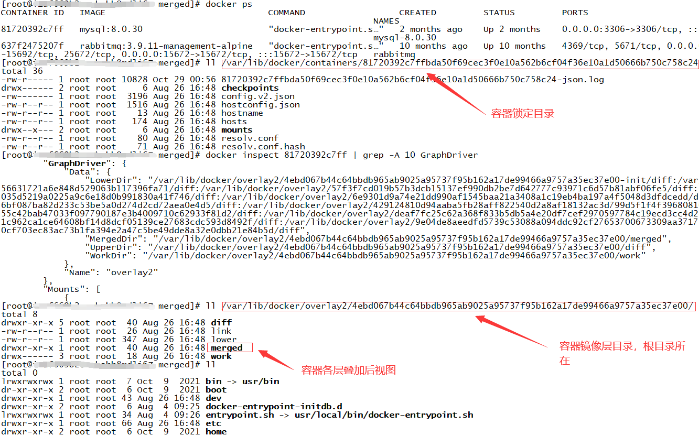

注：

GraphDriver中四个目录介绍：

- LowerDir：包含容器内所有层的文件系统，最后一层除外；
- UpperDir：容器最上层的文件系统。这也是反映任何运行时修改的地方；
- MergedDir：文件系统所有层的组合视图；
- WorkDir：用于管理文件系统的内部工作目录。

#### IPC Namepace

一个容器内的进程间通信，允许一个容器内的不同进程的(内存、缓存等)数据访问，但是不能跨容器直接访问其他容器的数据。

#### UTS Namespace

用于系统标识，其中包含了主机名 hostname 和域名 domainname ，它使得一个容器拥有属于自己 hostname标识，这个主机名标识独立于宿主机系统和其上的其他容器。

#### PID Namespace

Linux系统中，有一个 PID 为1的进程(init/systemd)是其他所有进程的父进程，那么在每个容器内也要有一个父进程来管理其下属的子进程，那么多个容器的进程通 PID namespace 进程隔离(比如：PID 编号重复、器内的主进程生成与回收子进程等)。

#### NET Namespace

每一个容器都类似于虚拟机一样有自己的网卡、监听端口、TCP/IP 协议栈等，Docker 使用 network namespace启动一个 vethX 接口，这样你的容器将拥有它自己的桥接 ip 地址，通常是 docker0，而 docker0 实质就是 Linux 的虚拟网桥,网桥是在 OSI 七层模型的数据链路层的网络设备，通过 mac 地址对网络进行划分，并且在不同网络直接传递数据。


#### User Namespace

允许在各个宿主机的各个容器空间内创建相同的用户名以及相同的用户 UID 和 GID，只是会把用户的作用范围限制在每个容器内，即 A 容器和 B 容器可以有相同的用户名称和 ID 的账户，但是此用户的有效范围仅是当前容器内，不能访问另外一个容器内的文件系统，即相互隔离。

### cgroup

在一个容器，如果不对其做任何资源限制，则宿主机会允许其占用无限大的内存空间，有时候会因为代码 bug 程序会一直申请内存，直到把宿主机内存占完，为了避免此类的问题出现，宿主机有必要对容器进行资源分配限制，比如 CPU、内存等，Linux Cgroups 的全称是 Linux Control Groups，它最主要的作用，就是限制一个进程组能够使用的资源上限，包括 CPU、内存、磁盘、网络带宽等等。此外，还能够对进程进行优先级设置，以及将进程挂起和恢复等操作。

cgroups 具体实现：

- blkio：块设备IO限制；
- cpu：使用调度程序为 cgroup 任务提供 cpu 的访问；
- cpuacct：产生 cgroup 任务的 cpu 资源报告；
- cpuset：如果是多核心的 cpu，这个子系统会为 cgroup 任务分配单独的 cpu 和内存；
- devices：允许或拒绝 cgroup 任务对设备的访问；
- freezer：暂停和恢复 cgroup 任务；
- memory：设置每个 cgroup 的内存限制以及产生内存资源报告；
- net_cls：标记每个网络包以供 cgroup 方便使用；
- ns：命名空间子系统；
- perf_event：增加了对每 group 的监测跟踪的能力，可以监测属于某个特定的 group 的所有线程以及运行在特定 CPU 上的线程。

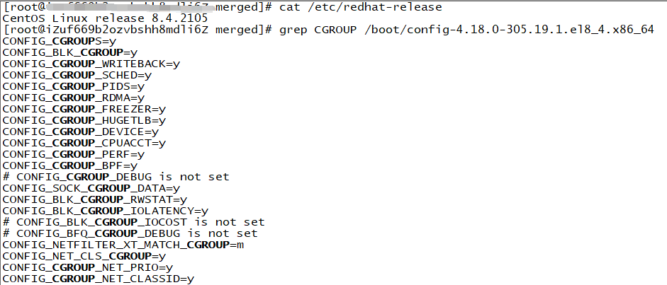

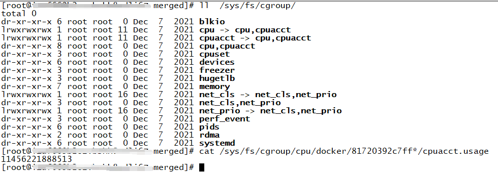

### UnionFS

UnionFS（联合文件系统）是一种分层、轻量级并且高性能的文件系统，它支持对文件系统的修改作为一次提交来一层层的叠加，同事可以将不同目录挂载到同一个虚拟文件系统。Union 文件系统是 docker 镜像的基础，镜像可以通过分层来进行继承，基于基础镜像，可以制作各种具体的应用镜像。

# 参考资料

[1]: https://docs.docker.com/	"Docker官方文档"
[2]: http://www.yunweipai.com/34815.html	"Docker第三方教程"
[3]: https://blog.csdn.net/anqixiang/article/details/114001509	"Docker命令详解"