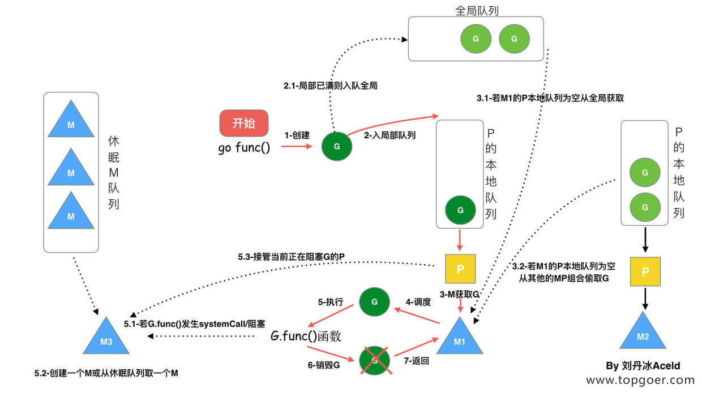

# golang 语法

## 基本类型

| 类型          | 长度(字节) | 默认值 | 说明                                      |
| :------------ | :--------- | :----- | :---------------------------------------- |
| bool          | 1          | false  |                                           |
| byte          | 1          | 0      | uint8                                     |
| rune          | 4          | 0      | Unicode Code Point, int32                 |
| int, uint     | 4或8       | 0      | 32 或 64 位                               |
| int8, uint8   | 1          | 0      | -128 ~ 127, 0 ~ 255，byte是uint8 的别名   |
| int16, uint16 | 2          | 0      | -32768 ~ 32767, 0 ~ 65535                 |
| int32, uint32 | 4          | 0      | -21亿~ 21亿, 0 ~ 42亿，rune是int32 的别名 |
| int64, uint64 | 8          | 0      |                                           |
| float32       | 4          | 0.0    |                                           |
| float64       | 8          | 0.0    |                                           |
| complex64     | 8          |        |                                           |
| complex128    | 16         |        |                                           |
| uintptr       | 4或8       |        | 以存储指针的 uint32 或 uint64 整数        |
| array         |            |        | 值类型                                    |
| struct        |            |        | 值类型                                    |
| string        |            | “”     | UTF-8 字符串                              |
| slice         |            | nil    | 引用类型                                  |
| map           |            | nil    | 引用类型                                  |
| channel       |            | nil    | 引用类型                                  |
| interface     |            | nil    | 接口                                      |
| function      |            | nil    | 函数                                      |

## 数组

1. 数组：是同一种数据类型的固定长度的序列；
2. 数组定义：`var a [len]int`，数组长度必须是常量，且是类型的组成部分。一旦定义，长度不能变；
3. 数组是值类型，赋值和传参会复制整个数组，而不是指针。因此改变副本的值，不会改变本身的值；
4. 支持 "=="、"!=" 操作符，因为内存总是被初始化过的；
5. 指针数组  [n]*T，数组指针  *[n]T。

## 切片

slice 并不是数组或数组指针。它通过内部指针和相关属性引用数组片段，以实现变长方案。

1. 切片：切片是数组的一个引用，因此切片是引用类型。但自身是结构体，值拷贝传递；

2. 切片遍历方式和数组一样，可以用 len() 求长度。表示可用元素数量，读写操作不能超过该限制；

3. cap 可以求出 slice 最大扩张容量，不能超出数组限制。`0 <= len(slice) <= len(array)`，其中 array 是 slice 引用的数组；

4. 切片的数据结构：

   ```go
   /*
   切片本身并不是动态数组或者数组指针。它内部实现的数据结构通过指针引用底层数组，设定相关属性将数据读写操作限定在指定的区域内。切片本身是一个只读对象，其工作机制类似数组指针的一种封装。
   
   切片是对数组一个连续片段的引用，所以切片是一个引用类型（因此更类似于 C/C++ 中的数组类型，或者 Python 中的 list 类型）。这个片段可以是整个数组，或者是由起始和终止索引标识的一些项的子集。需要注意的是，终止索引标识的项不包括在切片内。切片提供了一个与指向数组的动态窗口。
   
   给定项的切片索引可能比相关数组的相同元素的索引小。和数组不同的是，切片的长度可以在运行时修改，最小为 0 最大为相关数组的长度：切片是一个长度可变的数组。
   
   切片的结构体由 3 部分构成，Pointer 是指向一个数组的指针，len 代表当前切片的长度，cap 是当前切片的容量。cap 总是大于等于 len 的。
   */
   type slice struct {
       array unsafe.Pointer
       len   int
       cap   int
   }
   ```

5. nil 和空切片

   | nil 结构     |         |         |
   | ------------ | ------- | ------- |
   | nil          | Len = 0 | Cap = 0 |
   | Pointer      | int     | int     |
   | 空切片结构   |         |         |
   | Array        | Len = 0 | Cap = 0 |
   | Pointer      | int     | int     |
   | 0xc4200bec30 |         |         |

6. 切片扩容的策略：

   如果切片的容量小于 1024 个元素，于是扩容的时候就翻倍增加容量。上面那个例子也验证了这一情况，总容量从原来的 4 个翻倍到现在的 8 个。一旦元素个数超过 1024 个元素，那么增长因子就变成 1.25 ，即每次增加原来容量的四分之一。

   注意：扩容扩大的容量都是针对原来的容量而言的，而不是针对原来数组的长度而言的。

7. 切片拷贝：

   copy 方法会把源切片值中的元素复制到目标切片中，并返回被复制的元素个数，copy 的两个类型必须一致。copy 方法最终的复制结果取决于较短的那个切片，当较短的切片复制完成，整个复制过程就全部完成了。

   注：

   切片中有一个需要注意的问题：

   ```go
   func main() {
       slice := []int{10, 20, 30, 40}
       for index, value := range slice {
           fmt.Printf("value = %d , value-addr = %x , slice-addr = %x\n", value, &value, &slice[index])
       }
   }
   ```

   输出：

   ```
       value = 10 , value-addr = c4200aedf8 , slice-addr = c4200b0320
       value = 20 , value-addr = c4200aedf8 , slice-addr = c4200b0328
       value = 30 , value-addr = c4200aedf8 , slice-addr = c4200b0330
       value = 40 , value-addr = c4200aedf8 , slice-addr = c4200b0338
   ```

   从上面结果我们可以看到，如果用 range 的方式去遍历一个切片，拿到的 Value 其实是切片里面的值拷贝。所以每次打印 Value 的地址都不变。

## 指针

1. new 和 make 的区别：
   - 二者都是用来做内存分配的；
   - make 只用于 slice、map 以及 channel 的初始化，返回的还是这三个引用类型本身；
   - 而 new 用于类型的内存分配，并且内存对应的值为类型零值，返回的是指向类型的指针。

## Map

1. 判断某个键是否存在：`value, ok := map[key]`；

2. 按指定顺序遍历 map：

   ```go
   func main() {
       rand.Seed(time.Now().UnixNano()) // 初始化随机数种子
   
       var scoreMap = make(map[string]int, 200)
   
       for i := 0; i < 100; i++ {
           key := fmt.Sprintf("stu%02d", i) // 生成 stu 开头的字符串
           value := rand.Intn(100)          // 生成 0~99 的随机整数
           scoreMap[key] = value
       }
       // 取出 map 中的所有 key 存入切片 keys
       var keys = make([]string, 0, 200)
       for key := range scoreMap {
           keys = append(keys, key)
       }
       // 对切片进行排序
       sort.Strings(keys)
       // 按照排序后的 key 遍历 map
       for _, key := range keys {
           fmt.Println(key, scoreMap[key])
       }
   }
   ```

3. map 的实现原理：

   map用数组存储，每个数组下标处存储的是一个 bucket，每个 bucket 中可以存储 8 个 kv 键值对，当每个 bucket 存储的 kv 对到达8 个之后，会通过 overflow 指针指向一个新的 bucket，从而形成一个链表。

   ```go
   // bucket 结构体定义 b 就是 bucket
   type bmap{
       // top hash 通常包含该 bucket 中每个键的 hash 值的高八位
       // 如果 tophash[0] 小于 mintophash，则 tophash[0] 为桶疏散状态
       // bucketCnt 的初始值是 8
       tophash [bucketCnt]uint8
       // 接下来是bucketcnt键，然后是bucketcnt值。
       // ...
   ```

   看上面代码以及注释，我们能得到 bucket 中存储的 kv 是这样的，tophash 用来快速查找 key 值是否在该 bucket 中，而不同每次都通过真值进行比较；还有 kv的 存放，为什么不是 k1v1，k2v2….. 而是 k1k2…v1v2…，我们看上面的注释说的 map[int64]int8,key 是int64（8个字节），value 是 int8（一个字节），kv 的长度不同，如果按照 kv 格式存放，则考虑内存对齐 v 也会占用 int64，而按照后者存储时，8 个 v 刚好占用一个 int64。

   | bucket              |
   | ------------------- |
   | tophash 0,1,2,...,7 |
   | k1,k2,...,k7        |
   | v1,v2,...,v7        |
   | overflow            |

## 结构体

1. 自定义类型：`type MyInt int` 

   类型别名：`type TypeAlias = Type` ；

2. 构造函数实现：

   ```go
   func newPerson(name, city string, age int8) person {
       return &person{
           name: name,
           city: city,
           age:  age,
       }
   }
   ```

3. 结构体中字段大写开头表示可公开访问，小写表示私有；

4. json 序列化：

   ```go
   // Student 学生
   type Student struct {
       ID     int    `json:"id"` // 通过指定 tag 实现 json 序列化该字段时的 key
       Gender string // json 序列化是默认使用字段名作为 key
       name   string // 私有不能被 json 包访问
   }
   
   func main() {
       s1 := Student{
           ID:     1,
           Gender: "女",
           name:   "pprof",
       }
       data, err := json.Marshal(s1)
       if err != nil {
           fmt.Println("json marshal failed!")
           return
       }
       fmt.Printf("json str:%s\n", data) //json str:{"id":1,"Gender":"女"}
   ```

## 流程控制

1. type switch：

   ```go
   switch x.(type){
       case type:
          statement(s)      
       case type:
          statement(s)
       default: // optional
          statement(s)
   }   
   ```

2. select:

   ```go
   /*
       每个 case 都必须是一个通信
       所有 channel 表达式都会被求值
       所有被发送的表达式都会被求值
       如果任意某个通信可以进行，它就执行；其他被忽略。
       如果有多个 case 都可以运行，select 会随机公平地选出一个执行
       否则：
       如果有 default 子句，则执行该语句
       如果没有 default 字句，select 将阻塞，直到某个通信可以运行；Go 不会重新对 channel 或值进行求值 
   */
   select {
       case communication clause:
          statement(s);      
       case communication clause:
          statement(s);
       default: // optional
          statement(s);
   } 
   ```

## 函数

1. 在默认情况下，Go 语言使用的是值传递，即在调用过程中不会影响到实际参数。

   注：无论是值传递，还是引用传递，传递给函数的都是变量的副本，不过，值传递是值的拷贝。引用传递是地址的拷贝，一般来说，地址拷贝更为高效。而值拷贝取决于拷贝的对象大小，对象越大，则性能越低。map、slice、chan、指针、interface 默认以引用的方式传递。

2. 闭包：

   ```go
   package main
   
   import "fmt"
   
   // 外部引用函数参数局部变量
   func add(base int) func(int) int {
       return func(i int) int {
           base += i
           return base
       }
   }
   
   func main() {
       tmp1 := add(10)
       fmt.Println(tmp1(1), tmp1(2))
       // 此时 tmp1 和 tmp2 不是一个实体了
       tmp2 := add(100)
       fmt.Println(tmp2(1), tmp2(2))
   }
   ```

3. defer：

   - 关键字 defer 用于注册延迟调用；
   - 这些调用直到 return 前才被执；
   - 多个 defer 语句，按先进后出的方式执行；
   - defer 语句中的变量，在 defer 声明时就决定了。

4. 异常处理

   panic：假如函数 F 中书写了 panic 语句，会终止其后要执行的代码，在 panic 所在函数F内如果存在要执行的 defer 函数列表，按照defer 的逆序执行；返回函数 F 的调用者 G，在 G 中，调用函数 F 语句之后的代码不会执行，假如函数 G 中存在要执行的 defer 函数列表，按照 defer 的逆序执行；直到 goroutine 整个退出，并报告错误。

   recover：在 defer 函数中，通过 recover 来终止一个 goroutine 的 panicking 过程，从而恢复正常代码的执行；可以获取通过 panic 传递的 error。

   注：

   - 导致关键流程出现不可修复性错误的使用 panic，其他使用 error；

   - 利用 recover 处理 panic 指令，defer 必须放在 panic 之前定义，另外 recover 只有在 defer 调用的函数中才有效。否则当 panic时，recover 无法捕获到 panic，无法防止 panic 扩散；

   - recover 处理异常后，逻辑并不会恢复到 panic 那个点去，函数跑到 defer 之后的那个点；

   - 多个 defer 会形成 defer 栈，后定义的 defer 语句会被最先调用。

   - ```go
     // try catch 实现
     func Try(fun func(), handler func(interface{})) {
         defer func() {
             if err := recover(); err != nil {
                 handler(err)
             }
         }()
         fun()
     }
     ```

## 方法

1. 方法集：
   - 类型 T 方法集包含全部 receiver T 方法；
   - 类型 *T 方法集包含全部 receiver T + *T 方法；
   - 如类型 S 包含匿名字段 T，则 S 和 *S 方法集包含 T 方法；
   - 如类型 S 包含匿名字段 *T，则 S 和 *S 方法集包含 T + *T 方法；
   - 不管嵌入 T 或 T，S 方法集总是包含 T + *T 方法。

## 接口

1. 对象赋值给接口时，会发生拷贝，而接口内部存储的是指向这个复制品的指针，既无法修改复制品的状态，也无法获取指针；
2. 只有当接口存储的类型和对象都为 nil 时，接口才等于 nil；
3. 接口调用不会做 receiver 的自动转换；
4. 接口命名习惯以 er 结尾；

## GMP

1. GMP 模型：

   

   - 全局队列（Global Queue）：存放等待运行的 G；

   - P 的本地队列：同全局队列类似，存放的也是等待运行的 G，存的数量有限，不超过 256 个。新建 G’ 时，G’ 优先加入到 P 的本地列，如果队列满了，则会把本地队列中一半的 G 移动到全局队列；

   - P 列表：所有的 P 都在程序启动时创建，并保存在数组中，最多有 GOMAXPROCS(可配置) 个；

   - M：线程想运行任务就得获取 P，从 P 的本地队列获取 G，P 队列为空时，M 也会尝试从全局队列拿一批 G 放到 P 的本地队列，或从其他 P 的本地队列偷一半放到自己 P 的本地队列。M 运行 G，G 执行之后，M 会从 P 获取下一个 G，不断重复下去。

     > P 和 M 的个数问题：
     >
     > P 的数量：
     >
     > - 由启动时环境变量 $GOMAXPROCS 或者是由 runtime 的方法 GOMAXPROCS() 决定。这意味着在程序执行的任意时刻都只有 $GOMAXPROCS 个 goroutine 在同时运行。
     >
     > M 的数量:
     >
     > - go 语言本身的限制：go 程序启动时，会设置 M 的最大数量，默认 10000。但是内核很难支持这么多的线程数，所以这个限制可以忽略；
     > - runtime/debug 中的 SetMaxThreads 函数，设置 M 的最大数量；
     > - 一个 M 阻塞了，会创建新的 M。
     >
     > M 与 P 的数量没有绝对关系，一个 M 阻塞，P 就会去创建或者切换另一个 M，所以，即使 P 的默认数量是 1，也有可能会创建很多个 M 出来。
     >
     > 
     >
     > P 和 M 何时会被创建：
     >
     > P 何时创建：在确定了 P 的最大数量 n 后，运行时系统会根据这个数量创建 n 个 P。
     >
     > M 何时创建：没有足够的 M 来关联 P 并运行其中的可运行的 G。比如所有的 M 此时都阻塞住了，而 P 中还有很多就绪任务，就会去寻找空闲的 M，而没有空闲的，就会去创建新的 M。

2. 调度器的设计策略：

   复用线程：避免频繁的创建、销毁线程，而是对线程的复用。

   1）work stealing 机制

    当本线程无可运行的 G 时，尝试从其他线程绑定的 P 偷取 G，而不是销毁线程。

   2）hand off 机制

    当本线程因为 G 进行系统调用阻塞时，线程释放绑定的 P，把 P 转移给其他空闲的线程执行。

   利用并行：GOMAXPROCS 设置 P 的数量，最多有 GOMAXPROCS 个线程分布在多个 CPU 上同时运行。GOMAXPROCS 也限制了并发的程度，比如 GOMAXPROCS = 核数/2，则最多利用了一半的 CPU 核进行并行。

   抢占：在 coroutine 中要等待一个协程主动让出 CPU 才执行下一个协程，在 Go 中，一个 goroutine 最多占用 CPU 10ms，防止其他 goroutine 被饿死，这就是 goroutine 不同于 coroutine 的一个地方。

   全局 G 队列：在新的调度器中依然有全局 G 队列，但功能已经被弱化了，当 M 执行 work stealing 从其他 P 偷不到 G 时，它可以从全局 G 队列获取 G。

3. go func() 调度流程

   

   1. 我们通过 go func () 来创建一个 goroutine；

   2. 有两个存储 G 的队列，一个是局部调度器 P 的本地队列、一个是全局 G 队列。新创建的 G 会先保存在 P 的本地队列中，如果 P 的本地队列已经满了就会保存在全局的队列中；

   3. G 只能运行在 M 中，一个 M 必须持有一个 P，M 与 P 是 1：1 的关系。M 会从 P 的本地队列弹出一个可执行状态的 G 来执行，如果 P 的本地队列为空，就会想其他的 MP 组合偷取一个可执行的 G 来执行；

   4. 一个 M 调度 G 执行的过程是一个循环机制；

   5. 当 M 执行某一个 G 时候如果发生了 syscall 或则其余阻塞操作，M 会阻塞，如果当前有一些 G 在执行，runtime 会把这个线程 M 从 P 中摘除 (detach)，然后再创建一个新的操作系统的线程 (如果有空闲的线程可用就复用空闲线程) 来服务于这个 P；

   6. 当 M 系统调用结束时候，这个 G 会尝试获取一个空闲的 P 执行，并放入到这个 P 的本地队列。如果获取不到 P，那么这个线程 M 变成休眠状态， 加入到空闲线程中，然后这个 G 会被放入全局队列中。