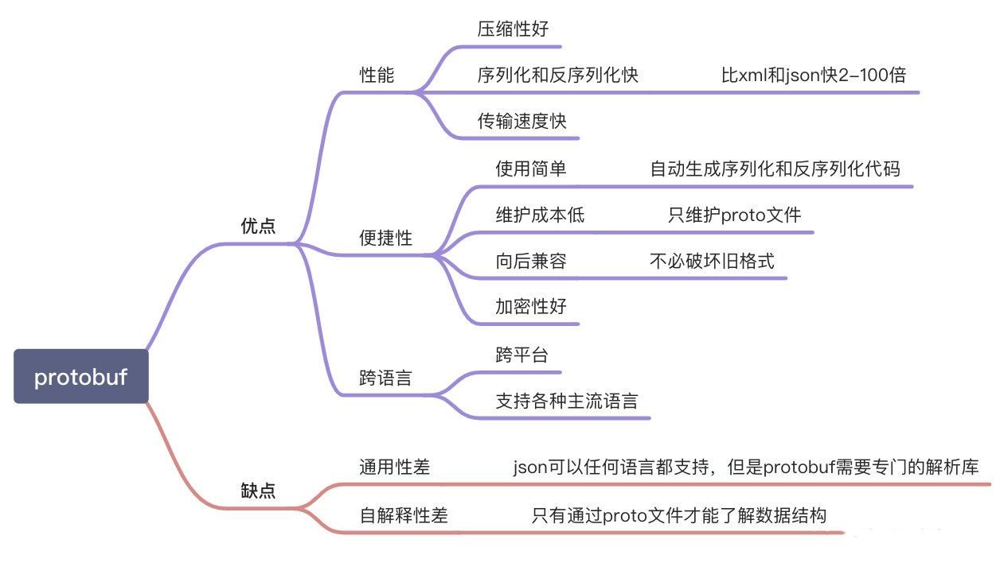

# 简介

Protobuf 是 Google 给出的一种通用的数据表示方式，通过 proto 文件定义的数据格式，可以一键式的生成 C++，Python，Java 等各种语言实现。Protobuf 经历了 protobuf2 和 protobuf3，pb3 比 pb2 简化了很多，目前主流的版本是 pb3。



# Protoc 的使用

## 安装

```shell
# 下载 proto 和 grpc
go get github.com/golang/protobuf/proto
go get google.golang.org/grpc
# 安装 protoc-gen-go 
go install github.com/golang/protobuf/protoc-gen-go@latest
go install github.com/golang/protobuf/protoc-gen-go-grpc@latest
```

## 编写 proto 文件

```go
syntax = "proto3"; // 指定proto版本
package hello;     // 指定默认包名

// 指定golang包名
option go_package = "hello";

// 定义Hello服务
service Hello {
    // 定义SayHello方法
    rpc SayHello(HelloRequest) returns (HelloResponse) {}
}

// HelloRequest 请求结构
message HelloRequest {
    string name = 1;
}

// HelloResponse 响应结构
message HelloResponse {
    string message = 1;
}
```

## 生成 go 文件

```shell
protoc --go_out=. --go_opt=paths=source_relative --go-grpc_out=. --go-grpc_opt=paths=source_relative ./auth.proto
```

## 实现服务端接口

```go
syntax = "proto3"; // 指定proto版本
package hello;     // 指定默认包名

// 指定golang包名
option go_package = "hello";

// 定义Hello服务
service Hello {
    // 定义SayHello方法
    rpc SayHello(HelloRequest) returns (HelloResponse) {}
}

// HelloRequest 请求结构
message HelloRequest {
    string name = 1;
}

// HelloResponse 响应结构
message HelloResponse {
    string message = 1;
}
```

## 客户端实现

```go
package main

import (
    pb "github.com/jergoo/go-grpc-example/proto/hello" // 引入proto包
    "golang.org/x/net/context"
    "google.golang.org/grpc"
    "google.golang.org/grpc/grpclog"
)

const (
    // Address gRPC服务地址
    Address = "127.0.0.1:50052"
)

func main() {
    // 连接
    conn, err := grpc.Dial(Address, grpc.WithInsecure())
    if err != nil {
        grpclog.Fatalln(err)
    }
    defer conn.Close()

    // 初始化客户端
    c := pb.NewHelloClient(conn)

    // 调用方法
    req := &pb.HelloRequest{Name: "gRPC"}
    res, err := c.SayHello(context.Background(), req)

    if err != nil {
        grpclog.Fatalln(err)
    }

    grpclog.Println(res.Message)
}
```


# buf

buf 对于 protoc 文件来说，相当于 go module 相对于 go 的作用，能够帮助我们管理 protoc 相关包和依赖。

## 安装

```go
go install github.com/bufbuild/buf/cmd/buf@v1.19.0
# 或者直接下载压缩包
```

## 示例

### 项目目录结构

```
|—— gen/ #生成后文件目录
    |—— api/
        |—— hello
           |—— v1/
               |—— hello.pb.go
               |—— hello.pb.gw.go
               |—— hello.swagger.json
               |—— hello_grpc.pb.go
|—— proto/
    |—— api/
        |—— v1/
            |—— hello.proto   // proto 描述文件
```


### 配置

### buf.yaml 文件

基本配置文件，放在 proto 目录下。

```yaml
version: v1
deps: # 添加 googleapis 依赖
  - buf.build/googleapis/googleapis
lint:
  use:
    - DEFAULT
breaking:
  use:
    - FILE
```

### buf.work.yaml 文件

```yaml
version: v1
directories:
  - proto # 扫描哪些目录下的 proto 文件
```

### buf.gen.yaml 文件

```yaml
version: v1
managed:
  enabled: true
  go_package_prefix:
    # <module_name>   : name in go.mod
    # <relative_path> : where generated code should be output
    default: github.com/levine824/monorepo/
    # Remove `except` field if googleapis is not used
    except:
      - buf.build/googleapis/googleapis
plugins: # 插件本地没有的话会远程下载
  - plugin: buf.build/grpc-ecosystem/gateway:v2.15.2
    out: gen
    opt:
      - paths=source_relative
  # dependencies
  - plugin: buf.build/protocolbuffers/go
    out: gen
    opt:
      - paths=source_relative
  - plugin: buf.build/grpc/go
    out: gen
    opt:
      - paths=source_relative
  - plugin: buf.build/grpc-ecosystem/openapiv2:v2.15.2
    out: gen
```

### proto 文件

```go
syntax = "proto3";
package hello.v1;

import "google/api/annotations.proto";

service Hello{
  rpc SayHello(HelloRequest) returns(HelloReply){
    option (google.api.http) = { // 对应 http 请求
      get: "/api/v1/hello/{name}"
    };
  };
}

message HelloRequest{
  string name = 1;
}

message HelloReply{
  string message = 1;
}
```

# 参考链接

[1]: https://buf.build/docs	"buf 官方文档"
[2]: https://github.com/googleapis/googleapis	"googleapis 地址"
[3]: https://grpc-ecosystem.github.io/grpc-gateway/docs/tutorials/adding_annotations/	"grpc-gateway"
[4]: https://buf.build/plugins	"buf 插件仓库"

