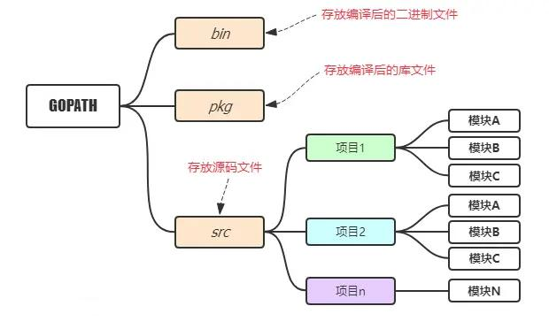
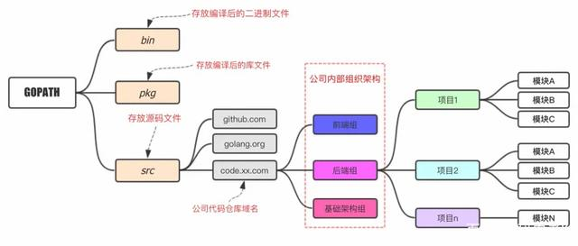
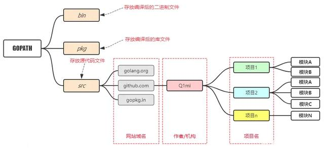

# GOPATH 目录结构

在进行 Go 语言开发的时候，我们的代码总是会保存在 $GOPATH/src 目录下。在工程经过 go build、go install 或 go get 等指令后，会将下载的第三方包源代码文件放在 $GOPATH/src 目录下，产生的二进制可执行文件放在 $GOPATH/bin 目录下，生成的中间缓存文件会被保存在 $GOPATH/pkg 下。

## **适合个人开发者**

## **适合企业开发者**

## **目前流行结构**

