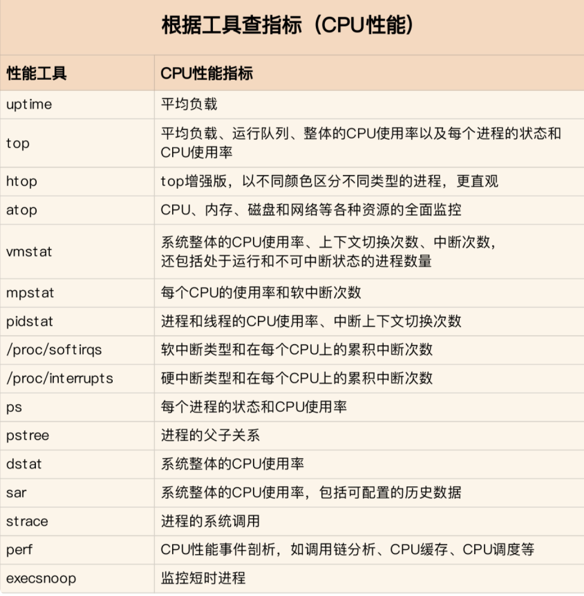

# 性能分析工具



## vmstat（虚拟内存统计）

vmstat（VirtualMeomoryStatistics，虚拟内存统计）是 Linux 中监控内存的常用工具，可对操作系统的虚拟内存、进程、CPU 等的整体情况进行监视。vmstat 的常规用法：vmstat interval times 即每隔 interval 秒采样一次，共采样 times 次，如果省略 times，则一直采集数据，直到用户手动停止为止。

第一行显示了系统自启动以来的平均值，第二行开始显示现在正在发生的情况，接下来的行会显示每5秒间隔发生了什么，每一列的含义在头部，如下所示：

- procs： 显示进程数，r 等待运行的进程,系统上的负载越多，等待运行 CPU 周期的进程数量越多。b 列显示多少进程正在不可中断的休眠（等待 IO )，也称为“被阻塞”的进程。

- memory：显示内存值，swapd 列显示了多少块被换出了磁盘（页面交换），free 列显示了多少块是空闲的（未被使用），buff列显示多少块正在被用作缓冲区，cache 列显示正在被用作操作系统的缓存。


- swap：显示交换活动：每秒有多少块正在被换入（从磁盘）和换出（到磁盘）。


- io：显示了多少块从块设备读取（bi）和写出（bo）,通常反映了硬盘 I/O。


- system：显示每秒中断（in）和上下文切换（cs）的数量。


- cpu：显示所有的 CPU 时间花费在各类操作的百分比，us 显示花费在用户进程中的 CPU 百分比，sy 系统进程使用的 CPU 百分比，id 可用 CPU 百分比，wa 花费在“等待 I/O”上的百分比。   

## iostat（报告中央处理器统计信息）

iostat 用于报告中央处理器（CPU）统计信息和整个系统、适配器、tty 设备、磁盘和 CD-ROM 的输入/输出统计信息，默认显示了与 vmstat 相同的 cpu 使用信息。

第一行显示的是自系统启动以来的平均值，然后显示增量的平均值，每个设备一行。

常见 linux 的磁盘 IO 指标的缩写习惯：rq 是 request，r 是 read，w 是 write，qu 是 queue，sz 是 size，a 是verage，tm 是 time，svc 是 service。

- rrqm/s 和 wrqm/s：每秒合并的读和写请求，“合并的”意味着操作系统从队列中拿出多个逻辑请求合并为一个请求到实际磁盘。


- r/s和w/s：每秒发送到设备的读和写请求数。


- rsec/s和wsec/s：每秒读和写的扇区数。


- avgrq –sz：请求的扇区数。


- avgqu –sz：在设备队列中等待的请求数。


- await：每个IO请求花费的时间。


- svctm：实际请求（服务）时间。


- %util：至少有一个活跃请求所占时间的百分比。

注：

ps 每秒的传输数量，例如，每秒的 I/O 操作数。注：这只是 I/O 操作的数量；每个操作可能非常大，也可能非常小。

Blk_read/s 每秒从该设备读取的块数。通常，块的大小为 512 字节。这是一个磁盘利用率较好的值。

Blk_wrtn/s 每秒写入该设备的块数

Blk_read 到目前为止从该设备读取的块数。注意，这并不是正在发生的情况。很多块已经从该设备读取。可能现在什么也没有读取。观察一段时间，看是否有变化。

Blk_wrtn 写入该设备的块数。

## pidstat（监控系统资源情况）

pidstat 主要用于监控全部或指定进程占用系统资源的情况,如 CPU,内存、设备 IO、任务切换、线程等。 

```shell
pidstat –d interval
# 统计 CPU 使用信息
pidstat –u interval
# 统计内存信息
pidstat –r interval
```

## top（实时显示系统中各个进程的资源占用情况）

top 命令的汇总区域显示了五个方面的系统性能信息：

- 负载：时间，登陆用户数，系统平均负载；


- 进程：运行，睡眠，停止，僵尸；


- cpu:用户态，核心态，NICE,空闲，等待IO,中断等；


- 内存：总量，已用，空闲（系统角度），缓冲，缓存；


- 交换分区：总量，已用，空闲


任务区域默认显示：进程 ID，有效用户，进程优先级，NICE 值，进程使用的虚拟内存，物理内存和共享内存，进程状态，CPU 占用率，内存占用率，累计 CPU 时间，进程命令行信息。

## mpstat（获取 CPU 相关统计信息）

mpstat 是 Multiprocessor Statistics的缩写，是实时系统监控工具。其报告CPU的一些统计信息，这些信息存放在 /proc/stat 文件中。在多 CPUs 系统里，其不但能查看所有 CPU 的平均状况信息，而且能够查看特定 CPU 的信息。常见用法：

```shell
mpstat –P ALL interval times
```

- user     表示处理用户进程所使用 CPU 的百分比；

- nice     表示使用 nice 命令对进程进行降级时 CPU 的百分比。nice 命令更改进程的优先级；

- system   表示内核进程使用的 CPU 百分比 ；

- iowait    表示等待进行 I/O 所使用的 CPU 时间百分比 ；

- irq      表示用于处理系统中断的 CPU 百分比；  

- soft     表示用于软件中断的 CPU 百分比 ； 

- idle     显示 CPU 的空闲时间。 

## netstat

netstat 用于显示与 IP、TCP、UDP和 ICMP 协议相关的统计数据，一般用于检验本机各端口的网络连接情况。常见用法：

```shell
netstat –npl   # 可以查看你要打开的端口是否已经打开。

netstat –rn    # 打印路由表信息。

netstat –in    # 提供系统上的接口信息，打印每个接口的MTU,输入分组数，输入错误，输出分组数，输出错误，冲突。
```

##  ps（显示当前进程的状态）

常见用法：

```shell
ps  aux       #hsserver

ps –ef |grep   #hundsun
# 杀某一进程
ps  aux | grep mysqld | grep –v grep | awk ‘{print $2 }’ xargs kill -9
# 杀僵尸进程
ps –eal | awk ‘{if ($2 == “Z”){print $4}}’ | xargs kill -9
```

## strace

跟踪程序执行过程中产生的系统调用及接收到的信号，帮助分析程序或命令执行中遇到的异常情况。

```shell
# 查看 mysqld 在 linux 上加载哪种配置文件
strace –e stat64 mysqld –print –defaults > /dev/null
```

## uptime

能够打印系统总共运行了多长时间和系统的平均负载，uptime 命令最后输出的三个数字的含义分别是 1分钟，5分钟，15分钟内系统的平均负荷。

## lsof

lsof（list open files）是一个列出当前系统打开文件的工具。通过 lsof 工具能够查看这个列表对系统检测及排错，常见的用法：

```
# 查看文件系统阻塞
lsof /boot
查看端口号被哪个进程占用

lsof  -i : 3306
查看用户打开哪些文件

lsof –u username
查看进程打开哪些文件

lsof –p  4838
查看远程已打开的网络链接

lsof –i @192.168.34.128
```

## perf

perf 是 Linux kernel 自带的系统性能优化工具。优势在于与 Linux Kernel 的紧密结合，它可以最先应用到加入 Kernel 的new feature，用于查看热点函数，查看 cashe miss 的比率，从而帮助开发者来优化程序性能。

性能调优工具如 perf，Oprofile 等的基本原理都是对被监测对象进行采样，最简单的情形是根据 tick 中断进行采样，即在 tick 中断内触发采样点，在采样点里判断程序当时的上下文.

## free（显示内存使用情况）

```shell
free -g
```

# 参考资料

[1]: https://blog.csdn.net/u012343977/article/details/128007262	"性能分析命令详解"
[2]: https://www.cnblogs.com/xiaoxi-jinchen/p/16250684.html	"性能分析命令总结"
[3]: https://blog.csdn.net/junmoxi/article/details/107048654	"Linux 性能分析"
[4]: https://www.bilibili.com/read/cv19149300/	"性能分析工具汇总"

