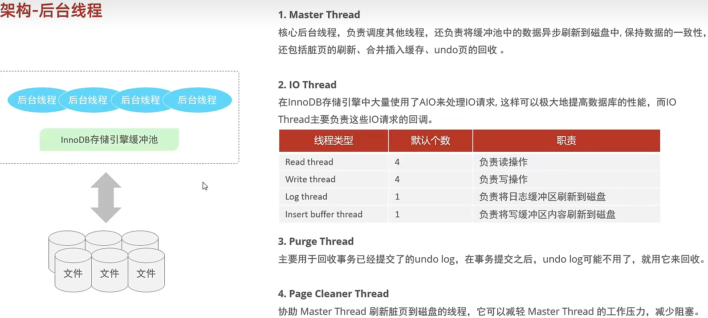

# 基础

## 数据类型

数值类型：

| 类型      | 大小    | 有符号(SIGNED)范围         | 无符号(UNSIGNED)范围 | 描述                 |
| --------- | ------- | -------------------------- | -------------------- | -------------------- |
| TINYINT   | 1 byte  | (-128,127)                 | (0,255)              | 小整数值             |
| SMALLINT  | 2 bytes | (-32768,32767)             | (0,65536)            | 大整数值             |
| MEDIUMINT | 3 bytes |                            |                      | 大整数值             |
| INT       | 4 bytes |                            |                      | 大整数值             |
| BIGINT    | 8 bytes |                            |                      | 极大整数值           |
| FLOAT     | 4 bytes |                            |                      | 单精度浮点数         |
| DOUBLE    | 8 bytes |                            |                      | 双精度浮点数         |
| DECIMAL   |         | 依赖于M(精度)和D(标度)的值 |                      | 小数值（精确定点数） |

字符类型：

| 类型       | 大小               | 描述                          | 备注                 |
| ---------- | ------------------ | ----------------------------- | -------------------- |
| CHAR       | 0-255 bytes        | 定长字符串                    |                      |
| VARCHAR    | 0-65535 bytes      | 变长字符串                    |                      |
| TINYBLOB   | 0-255 bytes        | 不超过255个字符的二进制数据源 | 以下不常用，性能欠佳 |
| TINYTEXT   | 0-255 bytes        | 短文本字符串                  |                      |
| BLOB       | 0-65535 bytes      | 二进制形式的长文本数据        |                      |
| TEXT       | 0-65535 bytes      | 长文本数据                    |                      |
| MEDIUMBLOB | 0-16777215 bytes   | 二进制形式的中等长度文本数据  |                      |
| MEDIUMTEXT | 0-16777215 bytes   | 中等长度文本数据              |                      |
| LONGBLOB   | 0-4294967295 bytes | 二进制形式的极大文本数据      |                      |
| LONGTEXT   | 0-4294967295 bytes | 极大文本数据                  |                      |

日期类型：

| 类型      | 大小 | 格式                | 描述           |
| --------- | ---- | ------------------- | -------------- |
| DATE      | 3    | YYYY-MM-DD          | 日期值         |
| TIME      | 3    | HH:MM:SS            | 时间值         |
| YEAR      | 1    | YYYY                | 年份值         |
| DATETIME  | 8    | YYYY-MM-DD HH:MM:SS | 混合日期时间值 |
| TIMESTAMP | 4    | YYYY-MM-DD HH:MM:SS | 时间戳         |

## DDL

### 数据库操作

```sql
--查询数据库
SHOW DATABASES;
--查询当前数据库
SELECT DATABSE();
--创建
CREATE DATABSE [IF NOT EXISTS] 数据库名 [DEFAULT CHARSET 字符集] [COLLATE 排序规则];
--删除
DROP DATABASE [IF EXISTS] 数据库名;
--使用
USE 数据库名;
```

### 表操作

#### 查询

```sql
--查询当前数据库所有表 
SHOW TABLES;
--查询表结构
DESC 表名;
--查询指定表的建表语句
SHOW CREATE TABLE 表名;
```

#### 创建

```sql
CREATE TABLE 表名(
  字段1 字段1类型[COMMENT 字段1注释],
  字段2 字段2类型[COMMENT 字段2注释],
  字段3 字段3类型[COMMENT 字段3注释],
  ...
  字段n 字段n类型[COMMENT 字段n注释]
)[COMMENT 表注释];
```

#### 修改

```sql
--添加字段
ALTER TABLE 表名 ADD 字段名 类型(长度) [COMMENT 注释] [约束];
--修改数据类型
ALTER TABLE 表名 MODIFY 字段名 新数据类型(长度);
--修改字段名和字段类型
ALTER TABLE 表名 CHANGE 旧字段名 新字段名 类型(长度) [COMMENT 注释] [约束];
--删除字段
ALTER TABLE 表名 DROP 字段;
--修改表名
ALTER TABLE 表名 RENAME TO 新表名;
--删除表
DROP TABLE [IF EXISTS] 表名;
--截断表(删除表并重新创建)
TRUNCATE TABLE 表名;
```

## DML

### 添加数据

```sql
--给指定字段添加数据
INSERT INTO 表名(字段名1,字段名2,...) VALUES(值1,值2,...);
--给全部字段添加数据
INSERT INTO 表名 VALUES(值1,值2,...);
--批量添加数据
INSERT INTO 表名(字段名1,字段名2,...) VALUES(值1,值2,...),(值1,值2,...),(值1,值2,...);
INSERT INTO 表名 VALUES(值1,值2,...),(值1,值2,...),(值1,值2,...);
```

### 修改/删除数据

```sql
--修改数据
UPDATE 表名 SET 字段名1=值1,字段名2=值2,...[WHERE 条件];
--删除数据
DELETE FROM 表名 [WHERE 条件];
```

## DQL

```sql
SELECT
      字段列表
FROM
      表名列表
WHERE
      条件列表
GROUP BY
      分组字段列表
HAVING
      分组后条件列表
ORDER BY
      排序字段列表
LIMIT
      分页参数
```

### 基本查询

```sql
--查询多个字段
SELECT * FROM 表名;
SELECT 字段1,字段2,字段3...FROM 表名;
--设置别名
SELECT 字段1 [AS 别名1],字段2[AS 别名2] ... FROM 表名;
--去除重复记录
SELECT DISTINCT 字段列表 FROM 表名;
```

### 条件查询

```sql
SELECT 字段列表 FROM 表名 WHERE 条件列表;
```

#### 条件

| 比较运算符          | 功能                                      | 逻辑运算符 | 功能 |
| ------------------- | ----------------------------------------- | ---------- | ---- |
| >                   | 大于                                      | AND 或 &&  | 并且 |
| >=                  | 大于等于                                  | OR 或 \|\| | 或者 |
| <                   | 小于                                      | NOT  或 !  | 非   |
| <=                  | 小于等于                                  |            |      |
| =                   | 等于                                      |            |      |
| <> 或 !=            | 不等于                                    |            |      |
| BETWEEN ... AND ... | 在某个范围内（含最小、最大值）            |            |      |
| IN(...)             | 在列表中的值，多选一                      |            |      |
| LIKE 占位符         | 模糊匹配（_匹配单个字符,%匹配任意个字符） |            |      |
| IS NULL             | 是NULL吗                                  |            |      |

### 分组查询

```sql
SELECT 字段列表 FROM 表名 [WHERE 条件] GROUP BY 分组字段名 [HAVING 分组后过滤条件];
```

注：

where和having区别

- 执行时机不同：where是分组之前进行过滤，不满足条件，不参与分组；而having是分组之后对结果进行过滤。
- 判断条件不同：where不能对聚合函数进行判断，而having可以。

执行顺序：where > 聚合函数 > having。

分组之后，查询的字段一般为聚合函数和分组字段，查询其他字段无任何意义。

#### 常见聚合函数

| 函数  | 功能     |
| ----- | -------- |
| COUNT | 统计数量 |
| MAX   | 最大值   |
| MIN   | 最小值   |
| AVG   | 平均值   |
| SUM   | 求和     |

```sql
SELECT 聚合函数(字段列表) FROM 表名;
```

注：null值不参与聚合函数运算。

### 排序查询

```sql
SELECT 字段列表 FROM ORDER BY 字段1 排序方式1,字段2 排序方式2;
```

#### 排序方式

- ASC：升序（默认值）
- DESC：降序

### 分页查询

```sql
SELECT 字段列表 FROM 表名 LIMIT 起始索引,查询记录数;
```

注：

- 起始索引从0开始，起始索引=（查询页码-1）*每页记录数。
- 如果查询的是第一页数据，起始索引可以省略。

### 执行顺序

FROM

WHERE

GROUP BY

HAVING

SELECT

ORDER BY

LIMIT

## DCL

### 管理用户

```sql
--查询用户
USE mysql;
SELECT * FROM user;
--创建用户
CREATE USER '用户名'@'主机名' IDENTIFIED BY '密码';
--修改用户密码
ALTER USER '用户名'@'主机名' IDENTIFIED WITH mysql_native_password BY '新密码';
--删除用户
DROP USER '用户名'@'主机名';
```

注： 主机名可以使用%统配。

### 权限控制

```sql
--查询权限
SHOW GRANTS FOR '用户名'@'主机名';
--授予权限
GRANT 权限列表 ON 数据库名.表名 TO '用户名'@'主机名';
--撤销权限
REVOKE 权限列表 ON 数据库名.表名 FROM '用户名'@'主机名';
```

注：

- 多个权限之间使用逗号分隔
- 授权时，数据库和表名可以使用*通配

#### 常用权限

| 权限               | 说明               |
| ------------------ | ------------------ |
| ALL,ALL PRIVILEGES | 所有权限           |
| SELECT             | 查询数据           |
| INSERT             | 插入数据           |
| UPDATE             | 修改数据           |
| DELETE             | 删除数据           |
| ALTER              | 修改表             |
| DROP               | 删除数据库/表/视图 |
| CREATE             | 创建数据库/表      |

## 函数

注：以下表格中罗列的均为常用函数。

### 字符串函数

| 函数                     | 功能                                                    |
| ------------------------ | ------------------------------------------------------- |
| CONCAT(S1,S2,...,Sn)     | 字符串拼接，将S1,S2,...Sn拼接成一个字符串               |
| LOWER(str)               | 将字符串全部转为小写                                    |
| UPPER(str)               | 将字符串全部转为大写                                    |
| LPAD(str,n,pad)          | 左填充，用字符串pad对str左边进行填充，达到n个字符串长度 |
| RPAD(str,n,pad)          | 右填充，用字符串pad对str右边进行填充，达到n个字符串长度 |
| TRIM(str)                | 去掉字符串头部和尾部的空格                              |
| SUBSTRING(str,start,len) | 返回从字符串str从start位置起的len个长度的字符串         |

### 数值函数

| 函数       | 功能                           |
| ---------- | ------------------------------ |
| CEIL(x)    | 向上取整                       |
| FLOOR(x)   | 向下取整                       |
| MOD(x,y)   | 返回x/y的模                    |
| RAND()     | 返回0-1的随机数                |
| ROUND(x,y) | 求参数x的四舍五入，保留y位小数 |

### 日期函数

| 函数                              | 功能                                              |
| --------------------------------- | ------------------------------------------------- |
| CURDATE()                         | 返回当前日期                                      |
| CURTIME()                         | 返回当前时间                                      |
| NOW()                             | 返回当前日期和时间                                |
| YEAR(date)                        | 获取指定date的年份                                |
| MONTH(date)                       | 获取指定date的月份                                |
| DAY(date)                         | 获取指定date的日期                                |
| DATE_ADD(date,Interval expr type) | 返回一个日期/时间值加上一个时间间隔expr后的时间值 |
| DATEDIFF(date1,date2)             | 返回起始时间date1和结束时间date2之间的天数        |

### 流程函数

| 函数                                                       | 功能                                                     |
| ---------------------------------------------------------- | -------------------------------------------------------- |
| IF(value,t,f)                                              | 如果value为true，则返回t，否则返回f                      |
| IFNULL(value1,value2)                                      | 如果value1不为空，返回value1，否则返回value2             |
| CASE WHEN [val1] THEN [res1] ... ELSE [default] END        | 如果val1为true，返回res1, ... 否则返回default默认值      |
| CASE [expr] WHEN [val1] THEN [res1] ... ELSE [default] END | 如果expr的值等于val1，返回res1，...否则返回default默认值 |

## 约束

| 约束     | 描述                                                     | 关键字      |
| -------- | -------------------------------------------------------- | ----------- |
| 非空约束 | 限制该字段的数据不能为null                               | NOT NULL    |
| 唯一约束 | 保证字段的所有数据都是唯一、不重复的                     | UNIQUE      |
| 主键约束 | 主键是一行数据的唯一标识，要求非空且唯一                 | PRIMARY KEY |
| 默认约束 | 保存数据时，若果未指定该字段的值，则采用默认值           | DEFAULT     |
| 检查约束 | 保证字段值满足某一条件                                   | CHECK       |
| 外键约束 | 用来让两张表的数据之间建立连接，保证数据的一致性和完整性 | FOREIGN KEY |

### 外键

#### 添加外键

```sql
CREATE TABLE 表名(
      字段名 数据类型,
      ...
      [CONSTRAINT] [外键名称] FOREIGN KEY(外键字段名) REFERENCES 主表(主表列名)
  );
ALTER TABLE 表名 ADD CONSTRAINT 外键名称 FOREIGN KEY(外键字段名) REFERENCES 主表(主表列名);
```

#### 删除/更新外键

```sql
ALTER TABLE 表名 ADD CONSTRAINT 外键名称 FOREIGN KEY(外键字段) REFERENCES 主表名(主表字段名) ON UPDATE CASCADE ON DELETE CASCADE;
```

## 多表查询

### 内连接

```sql
--隐式内连接
SELECT 字段列表 FROM 表1,表2 WHERE 条件...;
--显式内连接
SELECT 字段列表 FROM 表1 [INNER] JOIN 表2 ON 连接条件...;
```

### 外连接

```sql
--左外连接（相当于查询表1的所有数据 包含表1和表2交集部分的数据）
SELECT 字段列表 FROM 表1 LEFT [OUTER] JOIN 表2 ON 条件...;
--右外连接
SELECT 字段列表 FROM 表1 RIGHT [OUTER] JOIN 表2 ON 条件...;
```

### 自连接

```sql
SELECT 字段列表 FROM 表A 别名A JOIN 表A 别名B ON 条件...;
```

### 联合查询

```sql
SELECT 字段列表 FROM 表A ...
UNION [ALL]
SELECT 字段列表 FROM 表B ...;
```

注：UNION会进行去重。

### 子查询

```sql
SELECT * FROM t1 WHERE column1 = (SELECT column1 FROM t2);
```

注：子查询外部语句可以是INSERT/UPDATE/DELETE/SELECT的任意一个。

根据子查询结果不同，分为：

- 标量子查询（子查询结果为单个值）
- 列子查询（子查询结果为一列）
- 行子查询（子查询结果为一行）
- 表子查询（子查询结果为多行多列）

根据子查询位置，分为：WHERE之后、FROM之后、SELECT之后。

标量子查询常用操作符：= 、<、 >、 >=、 <=

列子查询常用操作符：

| 操作符 | 描述                                 |
| ------ | ------------------------------------ |
| IN     | 在指定范围内，多选一                 |
| NOT IN | 不在指定集合范围之内                 |
| ANY    | 子查询返回列表中，有人以一个满足即可 |
| SOME   | 与ANY等同，使用SOME地方都可以使用ANY |
| ALL    | 子查询返回列表所有值都必须满足       |

行子查询常用操作符：= 、<>、 IN、 NOT IN 

表子查询常用操作符：IN

## 事务

### 操作

```sql
--查看/设置事务提交方式
SELECT @@autocommit;
SET @@AUTOCOMMIT = 0;
--提交事务
COMMIT;
--回滚事务
ROLLBACK;
--开启事务
START TRANSACTION 或 BEGIN;
--提交事务
COMMIT;
--回滚事务
ROLLBACK;
```

### 四大特性

原子性

一致性

隔离性

持久性

### 并发事务问题

| 问题       | 描述                                                         |
| ---------- | ------------------------------------------------------------ |
| 脏读       | 一个事务读到另外一个事务还没有提交的数据。                   |
| 不可重复读 | 一个事务先后读取同一条记录，但两次读取的数据不同             |
| 幻读       | 一个事务按照条件查询数据时，没有对应的数据行，但插入数据时，又发现这行数据已经存在，好像出现了幻影。 |

### 事务的隔离级别

| 隔离级别              | 脏读 | 不可重复读 | 幻读 |
| --------------------- | ---- | ---------- | ---- |
| READ Uncommitted      | 有   | 有         | 有   |
| Read Committed        | 无   | 有         | 有   |
| Repeatable Read(默认) | 无   | 无         | 有   |
| Serializable          | 无   | 无         | 无   |

```sql
--查看事务隔离级别
SELECT @@TRANSACTION_ISOLATION
--设置事务隔离级别
SET [SESSION|GLOBAL] TRANSACTION ISOLATION LEVEL {READ UNCOMMITTED|READ COMMITTED|REPEATABLE READ|SERIALIZABLE}
```

# 进阶

## 体系结构


## 存储引擎

### InnoDB

#### 介绍

兼顾高可靠性和高性能的通用存储引擎，MySQL5.5之后为默认引擎。

#### 特点

DML操作遵循ACID模型，支持事务；

行级锁，提高并发性能；

支持外键约束，保证数据的完整性和正确性；

#### 文件

xxx.ibd：xxx代表表名，每张表对应一个这样的表空间文件，存储该表的表结构、数据和索引。

参数：innodb_file_per_table


### MyISAM

#### 介绍

MyISAM是MySQL早期的默认存储引擎。

#### 特点

不支持事务，不支持外键

支持表锁，不支持行锁

访问速度快

#### 文件

xxx.sdi：存储表结构信息

xxx.MYD：存储数据

xxx.MYI：存储索引

### Memory

#### 介绍

Memory引擎的表数据是存储在内存中的，由于受到硬件问题、或断电问题的影响，只能将这些表作为临时表或缓存使用。

#### 特点

内存存放

hash索引（默认）

#### 文件

xxx.sdi：存储表结构信息

### 存储引擎的选择

| 特点         | InnoDB              | MyISAM | Memory |
| ------------ | ------------------- | ------ | ------ |
| 存储限制     | 64TB                | 有     | 有     |
| 事务安全     | 支持                | -      | -      |
| 锁机制       | 行锁                | 表锁   | 表锁   |
| B+tree索引   | 支持                | 支持   | 支持   |
| Hash索引     | -                   | -      | 支持   |
| 全文索引     | 支持（5.6版本以后） | 支持   | -      |
| 空间使用     | 高                  | 低     | N/A    |
| 内存使用     | 高                  | 低     | 中单   |
| 批量插入速度 | 低                  | 高     | 高     |
| 支持外键     | 支持                | -      | -      |

InnoDB：如果应用对事务的完整性有较高的要求，在并发条件下要求数据一致性，数据操作除了插入和查询外，还包含很多的更新、删除操作，那么选择InnoDB比较合适。

MyISAM：如果应用是以读和插入操作为主，只有很少的更新和删除操作，并且对事务的完整性、并发性要求不高，那么可以选择MyISAM。（目前主流的是使用MongoDB代替此类型的存储引擎）

Memory：所有数据保存在内存中，访问速度快，通常用于临时表及缓存。缺陷是对表的大小有限制，而且无法保证数据的安全性。（目前主流使用Redis）

### 索引

高效获取数据的数据结构（有序）。

优点

- 提高检索效率，降低IO成本
- 通过索引列对数据排序，降低数据排序成本，降低CPU消耗

缺点

- 索引占用存储空间
- 索引提高了查询效率，但降低了更新表效率

#### 索引结构

| 索引结构            | 描述                                                         |
| ------------------- | ------------------------------------------------------------ |
| B+Tree索引          | 最常见的索引类型，大部分引擎都支持该索引                     |
| Hash索引            | 底层数据结构是用哈希表实现的，只有精确匹配索引列的查询才有效，不支持范围查询 |
| R-tree(空间索引)    | MyISAM引擎的一个特殊索引类型，主要用于地理空间数据类型，使用很少 |
| Full-text(全文索引) | 是一种通过建立倒排索引，快速匹配文档的方式，类似于Lucene,Solr,Es |

| 索引          | InnoDB      | MyISAM | Memory |
| ------------- | ----------- | ------ | ------ |
| B+tree索引    | 支持        | 支持   | 支持   |
| Hash索引      | 不支持      | 不支持 | 支持   |
| R-tree索引    | 不支持      | 支持   | 不支持 |
| Full-text索引 | 5.6以后支持 | 支持   | 不支持 |

为什么InnoDB引擎选择B+tree作为存储结构？

1. 相对于二叉树，层级更少，搜索效率更高；
2. 对于Btree，无论叶子节点还是非叶子节点，都会存储数据，这样导致一页中存储的键值减少，指针跟着减少，要同样保存大量数据，只能增加树的高度，导致性能降低；
3. 相对于hash索引，B+tree支持范围匹配和排序。

#### 索引分类

| 分类     | 含义                         | 特点                     | 关键字   |
| -------- | ---------------------------- | ------------------------ | -------- |
| 主键索引 | 表中主键的索引               | 默认自动创建，只能有一个 | PRIMARY  |
| 唯一索引 | 避免同一表中的某列有重复数据 | 可以有多个               | UNIQUE   |
| 常规索引 | 快速定位特定数据             | 可以有多个               |          |
| 全文索引 | 查找文本中的关键字           | 可以有多个               | FULLTEXT |

在InnoDB存储引擎中，根据索引形式，又可以分为以下两种：

| 分类     | 含义                                                     | 特点               |
| -------- | -------------------------------------------------------- | ------------------ |
| 聚集索引 | 将数据存储与索引放到一块，索引结构的叶子节点保存了行数据 | 必须有，且只有一个 |
| 二级索引 | 将数据和索引分开，索引结构的叶子节点关联的是对应的主键   | 可以存在多个       |

聚集索引的选取规则：

- 如果存在主键，主键索引就是聚集索引；
- 如果不存在主键，将使用第一个唯一索引作为主键索引；
- 如果都没有，InnoDB会自动生成一个rowid作为隐藏的聚集索引。

##### 索引语法

```sql
--创建索引
CREATE [UNIQUE|FULLTEXT] INDEX index_name ON table_name (index_col_name,...); 
ALTER TABLE table_name ADD UNIQUE(index_col_name);
--查看索引
SHOW INDEX FROM table_name;
--删除索引
DROP INDEX index_name ON table_name;
```

### SQL性能分析

#### SQL执行频率

MySQL客户端连接成功后，通过show [session|global] status命令可以提供服务器状态信息。通过如下指令可以查看当前的数据库CRUD访问频次：

```sql
--查看SQL执行频率
SHOW GLOBAL STATUS LIKE 'Com_______';
```

#### 慢查询日志

慢查询日志记录了所有执行时间超过指定参数（long_query_time，单位秒，默认10秒）的所有SQL语句日志。

MySQL的慢查询日志默认没有开启，需要在配置文件（/etc/my.cnf）中配置如下信息：

```shell
# 开启MySQL慢查询日志开关
slow_query_log=1
# 设置慢查询日志时间为2秒，SQL语句执行时间超过2秒，就会被视为慢查询，记录慢查询日志
long_query_time=2
```

#### profile详情

show profiles能够在做SQL优化时帮助我们了解时间都耗费到哪里去了。通过having_profiling参数，能够看到当前MySQL是否支持profile操作：

```sql
SELECT @@have_profiling；
```

默认profiling是关闭的，可以通过set语句在session/global级别开启profiling：

```sql
SET profiling=1；
```

执行一系列的业务SQL操作，然后通过如下指令查看指令的执行耗时：

```sql
--查看每一条SQL的耗时基本情况
show profiles;
--查看指定query_id的SQL语句各个阶段的耗时情况
show profile for query query_id;
--查看指定query_id的SQL语句CPU的使用情况
show profile cpu for query query_id;
```

#### explain执行计划

```sql
EXPLAIN SELECT 字段列表 FROM 表名 WHERE 条件;
```

EXPLAIN执行计划各字段含义：

- Id：select查询的序列号，表示查询中执行select子句或者是操作表的顺序（id相同，执行顺序从上到下；id不同，值越大，越先执行）；
- select_type：表示SELECT的类型，常见取值有SIMPLE、PRIMARY、UNION、SUBQUERY等；
- type：表示连接类型，性能由好到差的连接类型为NULL、system、const、eq_ref、ref、range、index、all；
- possible_key：显示可能应用在这张表上的所有，一个或多个；
- Key：实际使用的索引，NULL表示没有使用索引；
- Key_len：表示使用索引的字节数，该值为索引字段最大可能长度，并非实际使用长度，在不损失精度的前提下，越短越好；
- rows：MySQL认为必须执行查询的行数，在InnoDB中只是预估值；
- filtered：表示返回结果行数占需读取行数的百分比，越大越好。

#### 索引的使用

##### 最左前缀法则

如果索引了多列（联合索引），要遵守最左前缀法则。最左前缀法则指的是查询从索引的最左列开始，并且不跳过索引的列。若果跳过某列，则索引将部分失效（后面的字段索引失效）。

##### 范围查询

联合索引中，出现范围查询（<,>），范围查询右侧的列索引失效。

注：情况允许的情况下可使用>=,<=优化范围查询。

##### 索引列运算

不要在索引列上进行运算符操作，索引将失效。

##### 字符串不加引号

字符串类型字段使用时，不加引号，索引将失效

##### 模糊查询

如果仅仅是尾部模糊匹配，索引不会失效，如果是头部模糊匹配，索引将失效。

##### or连接的条件

用or分隔开的条件，如果or前的条件中的列有索引，而后面的列中没有索引，那么涉及的索引都不会用到。

##### 数据分布影响

如果MySQL评估使用索引比全表扫描更慢，则不使用索引。

注：is null和is not null走不走索引由表中数据决定，不绝对。

##### SQL提示

SQL语句中加入一些人为提示来达到优化操作的目的：

```sql
--use index
explain select * from tb_user use index(idx_user_pro) where profession = '软件工程'; 
--ignore index
explain select * from tb_user ignore index(idx_user_pro) where profession = '软件工程'; 
--force index
explain select * from tb_user force index(idx_user_pro) where profession = '软件工程'; 
```

##### 覆盖索引

尽量使用覆盖索引（查询使用了索引，并且需要返回的列，在该索引中已经全部能够找到），减少select *。

##### 前缀索引

当字段类型为字符串（varchar，text等）时，为了防止索引过大，影响查询效率，此时可以只将字符串的一部分前缀，建立索引，这样可以大大节约索引空间，提升索引效率。

```sql
create index idx_xxx on table_name(cloumn(n));
```

注：前缀长度可以根据索引的选择性来决定，而选择性是指不重复的索引值和数据表记录总数的比值，索引选择性越高则查询效率越高，唯一索引的选择性为1。这是最好的索引选择性，性能也最好。

##### 单列索引/联合索引

单列索引的情况下，多条件联合查询时，MySQL优化器会评估哪个字段的索引效率更高，会选择该索引完成本次查询。

##### 索引设计原则

1. 针对数据量较大，且查询比较频繁的表建立索引。
2. 针对常作为查询条件、排序、分组操作的字段建立索引。
3. 尽量选择区分度高的列作为索引，尽量建立唯一索引，区分度越高，使用索引效率越高。
4. 如果是字符串类型的字段，字段的长度较长，可以针对字段的特点，建立前缀索引。
5. 建议使用联合索引，减少单列索引，查询时，联合索引很多时候可以覆盖索引，节省存储空间，避免回表查询。
6. 要控制索引数量，避免影响增删改的效率。
7. 如果索引列不能存储NULL值，请在创建表时使用NOT NULL约束它。当优化器知道每列是否包含NULL值时，它可以更好的确定哪个索引最有效地用于查询。

## SQL优化

#### insert优化

1. 批量插入
2. 手动提交事务
3. 主键顺序插入
4. 大批量数据插入

  如果一次性需要插入大批量数据，使用insert语句插入性能较低，此时可以使用load指令插入。

```sql
--客户端连接服务器时，加上参数 --local-infile
mysql --local-infile -uroot -p
--设置全局参数local_file为1，开启从本地加载文件导入数据开关
set global_infile = 1;
--执行load指令将准备好的数据，加载到表中
load data local infile '/root/sql1.log' into table 'tb_user' fields terminated by ',' lines terminated by '\n';
```

#### 主键优化

在InnoDB中，表数据都是根据主键顺序组织存放的，这种存储方式的表称为索引组织表。

##### 页分裂

页可以为空，也可以填充一半，也可以填满。每个页包含2-N行数据（如果一行数据过大，会行溢出），根据主键排列。

##### 页合并

当删除一行记录时，实际上并没有被物理删除，只是记录被标记未删除，并且它的空间允许被其他记录声明使用。

当页中记录达到MERGE_THRESHOLD(默认为页的50%)，InnoDB会开始寻找最靠近的页看看是否可以将两个页合并以优化空间使用。

注：MERGE_THRESHOLD：合并页的阈值，可以自己设置，在创建表或者索引时指定。

##### 主键设计原则

- 满足业务需求的前提下，尽量降低主键的长度；
- 插入数据时，尽量顺序插入，选择使用自增主键；
- 尽量不要使用UUID做主键或其他自然主键；
- 业务操作时，尽量避免对主键修改。

#### order by优化

1. Using filesort：通过表的索引或全表扫描，读取满足条件的数据行，然后再排序缓冲区sort buffer中完成排序操作，所有不是通过索引直接返回结果的排序都叫FileSort排序。
2. Using index：通过有序索引顺序扫描直接返回有序数据，这种情况即为using index，不需要额外排序，操作效率高。

##### order by优化原则

- 根据排序字段建立合适索引，多字段排序时，也遵循最左前缀法则；
- 尽量使用覆盖索引；
- 多字段排序，一个升序一个降序，此时需要注意联合索引再创建时的规则（ASC/DESC）；
- 如果不可避免的出现filesort，大数据量排序时，可适当增加排序缓冲区的大小sort_buffer_size（默认256k）。

#### group by优化

- 在分组操作时，可以通过索引来提高效率；
- 在分组操作时，索引的使用也是满足最左前缀法则的。

#### limit优化

优化思路：一般分页查询时，通过创建覆盖索引能够比较好的提高性能，可以通过覆盖索引加子查询的形式进行优化。

#### count优化

```sql
explain select count(*) from tables;
```

- MyISAM引擎吧一个表的总行数存在磁盘上了，因此执行count（*）的时候直接返回这个数，效率很高；
- InnoDB引擎没有存储行数，执行count（*）的时候，需要把数据一行行读出，然后累计计数。

优化思路：自己计数。

count的几种用法：

- count(主键)：InnoDB引擎会遍历整张表，把每一行的主键取出，返回给服务层，服务层拿到之后直接累加；
- count(字段)：没有not null约束：会遍历整张表，把每一行的字段值都取出，返回给服务层，服务层判断是否为null，不为null，计数累加；有not null约束：同上，但会直接累加，不用判断；
- count(1)：遍历整张表，但不取值。服务层对于返回的每一行，放一个数字1进去，直接按行进行累加；
- count(*)：不会取出所有字段，而是专门做了优化，不取值，服务层直接进行累加。

效率：count(字段)<count(主键)<count(1)约等于count(*)，所以尽量使用count(*)。

#### update优化

InnoDB的行锁是针对索引加的锁，不是针对记录加的锁，并且该索引不能失效，否则会从行锁升级为表锁。

## 存储对象

### 视图

视图只保存了查询SQL的逻辑，不保存查询结果。

```sql
--创建
CREATE [OR REPLACE] VIEW 视图名称[(列表名称)] AS SELECT语句 [WITH[CASCADED|LOCAL] CHECK OPTION];
--查询
--查看创建视图语句
SHOW CREATE VIEW 视图名称;
--查看数图数据
SELECT * FROM 视图名称...;
--修改
--方式一
CREATE [OR REPLACE] VIEW 视图名称[(列表名称)] AS SELECT语句 [WITH[CASCADED|LOCAL] CHECK OPTION];
--方式二
ALTER VIEW 视图名称[(列表名称)] AS SELECT语句 [WITH[CASCADED|LOCAL] CHECK OPTION];
--删除
DROP VIEW [IF EXISTS] 视图名称 [, 视图名称]...;
```

#### 视图的检查选项

当使用WITH CHECK OPTION子句创建视图时，MySQL会通过视图检查正在更改的每个行，例如：插入、更新、删除，以使其复合视图的定义。为了确定检查范围，mysql提供了两个选项CASCADED和LOCAL，默认值为CASCADED。

#### 视图的更新

要使视图更新，视图中的行与基础表中的行之间必须存在一对一的关系。如果视图包含以下任意一项，则视图不可更新：

- 聚合函数或窗口函数
- DISTINCT
- GROUP BY
- HAVING
- UNION或UNION ALL	

#### 作用

- 简单

​       经常被使用的查询可以被定义为视图，不必每次都指定全部条件

- 安全

​        数据库授权不能细化到特定的行和列上，但可以通过视图来实现

- 数据独立

​        可以屏蔽真实表结构的变化带来的影响

### 存储过程

存储过程是事先经过编译并存储在数据库中的一段SQL语句的集合。

```sql
--创建
CREATE PROCEDURE 存储过程名称([参数列表])
BEGIN

      -- SQL语句

END;
--调用
CALL 名称([参数]);
--查看
--查询指定数据库的存储过程及状态信息
SELECT * FROM INFORMATION_SCHEMA.ROUTINES WHERE ROUTINE_SCHEMA = 'XXX';
--查询某个存储过程的定义
SHOW CREATE PROCEDURE 存储过程名称;
--删除
DROP PROCEDURE [IF EXISTS] 存储过程名称;
```

注：在命令行中，执行创建存储过程的SQL时，需要通过关键字delimiter指定SQL语句的结束符。

#### 变量

##### 系统变量

```sql
// 查看系统变量
SHOW [SESSION|GLOBAL] VARIABLES; --查看所有系统变量
SHOW [SESSION|GLOBAL] VARIABLES LIKE '...'; --可以通过LIKE模糊匹配方式查找
SELECT @@[SESSION|GLOBAL] 系统变量名; --查看指定变量的值
// 设置系统变量
SET [SESSION|GLOBAL] 系统变量名 = 值;
SET @@[SESSION|GLOBAL] 系统变量名 = 值;
```

注：MySQL服务重启后，设置的系统参数会失效，如果想要不失效，需要修改配置文件。

##### 用户定义变量

```sql
--赋值
SET @var_name = expr [,@var_name=expr]...;
SET @var_name := expr [,@var_name:=expr]...;
SELECT @var_name := expr [,@var_name:=expr]...;
SELECT 字段名 INTO @var_name FROM 表名;
--使用
SELECT @var_name;
```

##### 局部变量

局部变量的范围是在其内声明的BEGIN...END块。

```sql
--声明
DECLARE 变量名 变量类型 [DEFAULT...];
--赋值
SET 变量名 = 值;
SET 变量名 := 值;
SELECT 字段名 INTO 变量名 FROM 表名...;
```

变量类型就是数据库字段的类型：INT、BIGINT、CHAR、VARCHAR等。

#### if

```sql
IF 条件1 THEN
  ...
ELSEIF 条件2 THEN
  ...
ELSE
  ...
END IF;
```

#### 参数

IN：输入参数

OUT：输出参数

INOUT：输入输出参数

```sql
CREATE PROCEDURE 存储过程名称([IN/OUT/INOUT 参数名 参数类型])
BEGIN
     --SQL语句
END;
```

#### case

```sql
--用法一
CASE case_value
       WHEN when_value1 THEN statement_list1
       [WHEN when_value2 THEN statement_list2]...
       [ELSE statement_list]
END CASE;
--用法二
CASE
       WHEN search_condition1 THEN statement_list1
       [WHEN search_condition2 THEN statement_list2]...
       [ELSE statement_list]
END CASE;
```

#### while

```sql
WHILE 条件 DO
      SQL逻辑...
END WHILE;
```

#### repeat

```sql
REPEAT
      SQL逻辑...
      UNTIL 条件
END REPEAT;
```

#### loop

```sql
[begin_label:] LOOP
       SQL逻辑...
END LOOP [end_label];

LEAVE label; --退出指定标记的循环体
ITERATE label; --直接进入下一次循环
```

#### 游标

游标是用用来存储查询结果集的数据类型。

```sql
--声明游标
DECALRE 游标名称 CURSOR FOR 查询语句;
--打开游标
OPEN 游标名称;
--获取游标记录
FETCH 游标名称 INTO 变量[,变量];
--关闭游标
CLOSE 游标名称;
```

#### 条件处理程序

可以用来定义在流程控制结构执行过程中遇到问题相应的处理步骤。

```sql
DECLARE handler_action HANDLER FOR condition_vale [,condition_vale]... statement;
/*
handler_action
      CONTINUE:继续执行当前程序
      EXIT:中止执行当前程序
condition_value
      SQL_STATE sqlstate_value:状态码
      SQLWARNING:所有以01开头的状态码
      NOT FOUND:所有以02开头的状态码
      SQLEXCEPTION:所有没有被SQLWARNING或NOT FOUND捕获的状态码
*/
```

### 存储函数

存储函数是有返回值的存储过程，存储函数的参数只能是IN类型的。

```sql
CREATE FUNCTION 存储函数名称([参数列表])
RETURNS type [characteristic...]
BEGIN
     --SQL语句
     RETURN...;
END;
/*
characteristic说明：
DETERMINISTIC:相同的输入参数总是产生相同的效果
NO SQL:不包含SQL语句
READS SQL DATA:包含读取数据的语句，但不包含写入数据的语句
*/
```

### 触发器

触发器是与表有关的数据库对象，指在insert/update/delete之前或之后，触发并执行触发器中定义的SQL语句合集。目前只支持行级触发器，不支持语句级。

| 触发器类型 | NEW和OLD                                               |
| ---------- | ------------------------------------------------------ |
| INSERT型   | NEW表示将要或者已经新增的数据                          |
| UPDATE型   | OLD表示修改之前的数据，NEW表示将要或者已经修改后的数据 |
| DELETE型   | OLD表示将要或者已经删除的数据                          |

```sql
--创建
CREATE TRIGGER trigger_name
BEFORE/AFTER INSERT/UPDATE/DELETE
ON tbl_name FOR EACH ROW --行级触发器
BEGIN
     trigger_stmt;
END;
--查看
SHOW TRIGGERS;
--删除
DROP TRIGGER [schema_name.]trigger_name; --如果没有指定schema_name，默认为当前数据库
```

### 锁

MySQL中的锁，按照锁的粒度分，分为以下三类：

1. 全局锁：锁定数据库中的所有表；
2. 表级锁：每次操作锁住整张表；
3. 行级锁：每次操作锁住对应的行数据。

#### 全局锁

全局锁就是对整个数据库实例加锁，加锁后整个实例就处于只读状态，后续DML、DDL都会被阻塞。典型场景就是全库的逻辑备份，对所有的表进行锁定，从而获取一致性视图，保证数据的完整性。

```sql
--加全局锁
flush tables with read lock;
```

在InnoDB引擎中，我么可以在备份时加上参数--single-transaction参数来完成不加锁的一致性备份。

```sql
mysqldump --single-transaction -uroot -p123456 itcast > itcast.sql
```

#### 表级锁

对于表级锁，主要分为以下三类：

1. 表锁；
2. 元数据锁；
3. 意向锁。

##### 表锁

对于表锁，分为两类：

1. 表共享读锁；
2. 表独占写锁。

```sql
--加锁
lock tables 表名... read/write;
--释放锁
unlock tables;
```

##### 元数据锁

MDL 加锁过程是自动控制，无需显式使用，在访问一张表的时候会自动加上。MDL 锁主要维护表元数据的一致性，在表上有活动事务的时候，不可以对元数据进行写入操作。为了避免 DML 和 DDL 冲突，保证读写的正确性。

在 MySQL5.5 中引入了 MDL，当对一张表进行增删改查的时候，加 MDL 读锁（共享）；当对表结构进行变更操作时，加 MDL 写锁（排他）。

| 对应SQL                              | 锁类型                               | 说明                                             |
| ------------------------------------ | ------------------------------------ | ------------------------------------------------ |
| lock tables xxx read/write           | SHARED_READ_ONLY/SHRED_NO_READ_WRITE |                                                  |
| select、select ...lock in share mode | SHARED_READ                          | 与SHARED_READ、SHARED_WRITE兼容，与EXCLUSIVE互斥 |
| insert、update、delete...            | SHARED_WRITE                         | 与SHARED_READ、SHARED_WRITE兼容，与EXCLUSIVE互斥 |
| alter table...                       | EXCLUSIVE                            | 与其他MDL都互斥                                  |

##### 意向锁

1. 意向共享锁（IS）：与表锁共享锁（read）兼容，与表锁排它锁（write）互斥；
2. 意向排它锁（IX）：与表锁共享锁和表锁排它锁都互斥，但意向锁之间不会互斥。

查看意向锁级行锁情况：

```sql
select object_schema,object_name,index_name,lock_type,lock_mode,lock_data from performance_schema.data_locks;
```

#### 行级锁

InnoDB 的数据是基于索引组织的，行锁是通过对索引上的索引项加锁来实现的，而不是对记录加锁。对于行级锁，主要分为以下三类：

1. 行锁（Record Lock）：锁定单行记录的锁防止其他事物对此进行update和delete。在RC、RR隔离级别下都支持；
2. 间隙锁（Gap Lock）：锁定索引记录的间隙（不含该记录），确保索引的间隙不变，防止其他事务在这个间隙进行insert，产生幻读。在RR隔离级别下都支持；
3. 临键锁（Next-Key Lock）：行锁和间隙锁组合，同时锁住数据和间隙，在RR隔离级别下支持。

InnoDB实现了以下两种类型的行锁：

1. 共享锁（S）：允许一个事务去读一行，阻止其他事务获得相同数据集的排它锁；
2. 排它锁（X）：允许获取排它锁的事务更新数据，阻止其他事务获得相同数据的共享锁和排它锁。

| SQL                         | 行锁类型 | 说明     |
| --------------------------- | -------- | -------- |
| INSERT...                   | 排它锁   | 自动加锁 |
| UPDATE...                   | 排它锁   | 自动加锁 |
| DELETE...                   | 排它锁   | 自动加锁 |
| SELECT                      | 不加锁   |          |
| SELECT...LOCK IN SHARE MODE | 共享锁   |          |
| SELECT...FOR UPDATE         | 排它锁   |          |

在默认情况下，InnoDB 在 REPEATABLE READ 事务隔离级别下运行，InnoDB 使用 next-key 锁进行搜索和索引扫描，以防止幻读。

1. 针对唯一索引进行检索时，对已存在的记录进行等值匹配时，将自动优化为行锁;
2. InnoDB 的行锁是针对于索引加的锁，不通过索引检索数据，那么 InnoDB 将对表中所有记录加锁，此时就会升级为表锁。


1. 索引上的等值查询（唯一索引），给不存在的记录加锁时，优化为间隙锁；
2. 索引上的等值查询（普通索引），向右遍历时最后一个值不满足查询需求时，next-key lock 退化为间隙锁；
3. 索引上的范围查询（唯一索引），会访问到不满足条件的第一个值为止。

注：间隙锁唯一目的是防止其他事务插入间隙。间隙锁可以共存，一个事务采用的间隙锁不会阻止另一个事务在同一间隙锁上采用间隙锁。

### InnoDB引擎

#### 逻辑存储结构


#### 架构

下面是InnoDB架构图，左侧为内存结构，右侧为磁盘结构。


##### 内存结构


##### 磁盘结构


##### 后台线程



#### 事务原理

原子性、一致性、持久性由redo log保证，隔离性由锁和MVCC保证。

##### redo log（持久性）

重做日志，记录的是事务提交时数据页的物理修改，是用来实现事务的持久性。

该日志文件由两部分组成：重做日志缓冲（redo log buffer）以及重做日志文件（redo log file），前者在内存中，后者在磁盘中。当事务提交后会把所有修改信息都存到该日志文件中，用于在刷新脏页到磁盘，发生错误时，进行数据恢复使用。

##### undo log（原子性）

回滚日志，用于记录数据被修改前的信息，作用包含两个：提供回滚和MVCC（多版本并发控制）。

undo log和redo log记录物理日志不一样，它是逻辑日志。可以认为当delete一条记录时，undo log中会记录一条对应的insert记录。当执行rollback时，就可以从undo log中的逻辑记录读取到相应内容并回滚。

undo log销毁：undo log在事务执行时产生，事务提交时，并不会立即删除undo log，因为这些日志可能还用于MVCC。

undo log存储：undo log采用段的方式进行管理和记录，存放在rollback segment回滚段中，内部包含1024个undo log segment。

#### MVCC

全称Multi-Version Concurrency Control，多版本并发控制。只维护一个数据的多个版本，使得读写操作没有冲突，快照读为MySQL实现MVCC提供了一个非阻塞读的功能。MVCC的具体实现，还需要依赖于数据库记录中的三个隐式字段、undo log日志和readView。


当前读

读取的记录的最新版本，读取时还要保证其他并发事务不能修改当前记录，会对读取的记录进行加锁。如：select ... locj in share mode、select  ... for update、update、insert、delete都是一种当前读。 


快照读

简单的select就是快照读，读取的是记录数据的可见版本，有可能是历史数据，不加锁，是非阻塞读。

- Read Committed：每次select，都生成一个快照读；
- Repeatable Read：开启事务后第一个select语句才是快照读的地方；
- Serializable：快照读退化为当前读。

##### 记录中的隐藏字段

DB_TRX_ID：最近修改的事务ID，记录插入这条记录或者最后一次修改记录的事务ID；

DB_ROLL_PTR：回滚指针，执行这条记录的上一个版本，用于配合undo log，指向上一个版本；

DB_ROW_ID：隐藏主键，如果表中没有指定主键，将会生成该隐藏字段。

##### undo log

回滚日志，在insert、update、delete的时候产生的便于数据回滚的日志。

当insert的时候，产生的undo log日志只在回滚时需要，在事务提交后，可被立即删除。

而update、delete的时候，产生的undo log日志不仅在回滚时需要，在快照读时也需要，不会被立即删除。

###### undo log版本链

不同事务或相同事务对同一条记录进行修改，会导致该记录的undo log生成一条记录版本链表，链表头部是最新的旧记录，链表尾部是最早的旧记录。

##### readview

ReadView是快照读SQL执行时MVCC提取数据的依据，记录并维护系统当前活跃的事务（未提交）id。

ReadView中包含了四个核心字段：

- m_ids：当前活跃事务ID集合；
- min_trx_id：最小活跃事务ID；
- max_trx_id：预分配事务ID，当前最大事务ID+1（因为事务ID是自增的）；
- creator_trx_id：ReadView创建者的事务ID。

版本链数据访问规则：

1. trx_id == creator_trx_id？可以访问该版本；
2. trx_id<min_trx_id？可以访问该版本；
3. trx_id>max_trx_id？不可以访问该版本；
4. min_trx_id<=trx_id<=max_trx_id？如果trx_id不在m_ids中是可以访问该版本的。

不同的隔离级别，生成ReadView的时机不同：

- READ COMMITTED：在事务中每一次执行快照读时生成ReadView；
- REPEATABLE READ：仅在事务中第一次执行快照读时生成ReadView，后续复用该ReadView。

### MySQL管理

#### 系统数据库

| 数据库             | 含义                                                         |
| ------------------ | ------------------------------------------------------------ |
| mysql              | 存储MySQL服务器正常运行所需要的各种信息（时区、主从、用户、权限等） |
| information_schema | 提供了访问数据库元数据的各种表和视图，包含数据库、表、字段类型级访问权限等 |
| performance_schema | 为MySQL服务器运行时状态提供了一个底层监控功能，主要用于收集数据库服务器性能参数 |
| sys                | 包含了一系列方便DBA和开发人员利用performance_schema性能数据库进行性能调优和诊断的视图 |

#### 常用工具

##### mysql客户端

语法：

​          mysql [options] [database]

选项：

​          -u, --user=name                      #指定用户名

​          -p, --password[=name]         #指定密码

​          -h, --host=name                      #指定服务器IP或域名

​          -P, --port=port                         #指定连接端口

​          -e, --execute=name               #执行SQL语句并退出

##### mysqladmin

是一个执行管理操作的客户端程序。可以用它来检查服务器的配置和当前状态、创建并删除数据库等。

##### mysqlbinlog

由于服务器生成的二进制日志文件以二进制格式保存，所以如果想检查这些文本的文本格式，就会使用到。

##### mysqlshow

客户端对象查找工具，用来很快地查找存在哪些数据库、数据库中的表、表中的列或者索引。

##### mysqldump

用来备份数据库或在不同数据库之间进行数据迁移。备份内容包含创建表，及插入表的SQL语句。

##### mysqimport/source

用来导入mysqldump -T导出的文件文本。

# 运维篇

## 日志

### 错误日志

错误日志记录了当mysqld启动和停止时，以及服务器在运行过程中发生任何严重错误是的相关信息。当MySQL发生故障时，推荐优先查看此日志。

该日志默认是开启的，默认存放目录/var/log，默认的日志文件名为mysqld.log。查看日志位置：

```sql
show variables like '%log_error%';
```

### 二进制日志

二进制（BINLOG）记录了所有的DDL（数据定义语言）语句和DML（数据操纵语言）语句，但不包括数据查询（SELECT、SHOW）语句。

作用：

1. 灾难时数据恢复；
2. MySQL的主从复制。

```sql
show variables like '%log_bin%';
```

#### 日志格式

STATEMENT：基于SQL语句的日志记录，记录的是SQL语句，对数据进行修改的SQL都会记录在日志文件中；

ROW：基于行的日志记录，记录的是每一行的数据变更；（默认）

MIXED：混合了前两种，默认采用STATEMENT，在某些特殊情况下会自动切换为ROW。

```sql
show variables like '%binlog_format%';
```

#### 日志查看

```shell
mysqlbinlog [参数选项] logfilename

参数选项：
        -d       指定数据库名称，只列出指定数据库的相关操作
        -o       忽略日志中的前n行命令
        -v       将行事件重构为SQL语句
        -w       将行事件重构为SQL语句，并输出注释信息
```

#### 日志删除

```sql
--删除binlog日志，删除之后，日志编号，将从binlog.000001重新开始
reset master;
--删除******编号之前的所有日志
purge master logs to 'binlog.******';
--删除日志为'yyyy-mm-dd hh24:mi:ss'之前产生的所有日志
purge master logs before 'yyyy-mm-dd hh24:mi:ss';
```

也可以在mysql的配置文件中配置二进制日志的过期时间，设置了以后，二进制日志会自动删除。

```sql
show variables like '%binlog_expire_logs_seconds%';
```

### 查询日志

查询日志中记录了客户端的所有操作语句，而二进制日志不包含查询数据的SQL语句。默认情况下，查询日志是未开启的。如果需要开启，修改MySQL配置文件，添加如下内容：

```shell
#该选项用来开启查询日志，0代表关闭，1代表开启
general_log=1
#设置日志的文件名，如果没有指定，默认文件名为host_name.log
general_log_file=mysql_query.log
```

### 慢查询日志

慢查询日志记录了所有执行时间超过参数long_query_time设置值并且扫描记录数不小于min_examined_row_limit的所有SQL语句的日志，默认未开启。long_query_time默认为10秒，最小为0，精度可到微秒。

```shell
#慢查询日志
slow_query_log=1
#执行时间参数
long_quey_time=2
```

默认情况下，不会记录管理语句，也不会记录不使用索引进行查找的查询。可以使用log_slow_admin_statements和更改此行为log_queries_not_using_indexes。

```shell
#记录执行较慢的管理语句
log_slow_admin_statements=1
#记录执行较慢的未使用索引的语句
log_queries_not_using_indexes=1
```

## 主从复制

### 概述

主从复制是指将数据库的DDL和DML操作通过二进制日志传到从库服务器中，然后在从库上对这些日志重新执行，从而使得从库和主库保持数据同步。

MySQL支持一台主库同时向多台从库进行复制，从库同时也可以作为其他从库的主库，实现链状复制。

MySQL复制的优点主要为以下三个方面：

1. 主库出现问题，可以快速切换到从库；
2. 实现读写分离；
3. 可以从从库中执行备份，避免影响主库服务。

### 原理


### 搭建

#### 主库配置

1. 修改配置文件/etc/my.cnf

```shell
#mysql服务ID，保证整个集群环境中唯一，取值范围：1-2^32-1，默认为1
server-id=1
#是否只读，1代表只读，0代表读写
read-only=0
#忽略的数据，指不需要同步的数据库
#binlog-ignore-db=mysql
#指定同步数据库
#binlog-do-db=db01
```

1. 重启MySQL服务器

```shell
systemctl restart mysqld
```

1. 登录mysql，创建远程连接的账号，并授予主从复制权限

```sql
--创建itcast用户，并设置密码，该用户可在任意主机连接该MySQL服务
CREATE USER 'itcast'@'%' IDENTIFIED WITH mysql_native_password BY 'Root@123456';
--为用户分配主从复制权限
GRANT REPLICATION SLAVE ON *.* TO 'itcast'@'%';
```

1. 通过指令，查看二进制日志坐标；

```sql
show master status;
```

字段含义说明：

- file：从哪个日志文件开始推送日志文件；
- position：从哪个位置开始推送日志；
- binlog_ignore_db：指定不需要同步的数据库。

#### 从库配置

1. 修改配置文件/etc/my.cnf

```shell
#mysql服务ID，保证整个集群环境中唯一，取值范围：1-2^32-1，默认为1
server-id=2
#是否只读，1代表只读，0代表读写
read-only=1
```

1. 重启MySQL服务器

```shell
systemctl restart mysqld
```

1. 登录mysql，设置主库配置

```shell
--8.0.23版本的语法
CHANGE REPLICATION SOURCE TO SOURCE_HOST='XXX.XXX',SOURCE_USER='XXX',SOURCE_PASSWORD='XXX',SOURCE_LOG_FILE='XXX',SOURCE_LOG_POS='XXX';
--8.0.23之前版本的语法
CHANGE MASTER TO MASTER_HOST='XXX.XXX',MASTER_USER='XXX',MASTER_PASSWORD='XXX',MASTER_LOG_FILE='XXX',MASTER_LOG_POS='XXX';
```

## 分库分表

### 介绍

#### 拆分策略

- 垂直拆分：

1. 垂直分库：以表为依据，根据业务将不同表拆分到不同库中。

   特点：

   1. 每个库的表结构不一样；
   2. 每个库的数据也不一样；
   3. 所有库的并集是全量数据。

1. 垂直分表：以字段为依据，根据字段属性将不同字段拆分到不同表中。

   特点：

   1. 每个表的结构都不一样；
   2. 每个表的数据都不一样，一般通过一列（主键/外键）关联；
   3. 所有表的并集是全量数据。


- 水平拆分：

1. 水平分库：以字段为依据，按照一定策略，将一个库的数据拆分到多个库中。

   特点：

   1. 每个库的表结构都一样；
   2. 每个库的数据都不一样；
   3. 所有库的并集是全量数据。

1. 水平分表：以字段为依据，按照一定策略，将一个表的数据拆分到多个库中。

   特点：

   1. 每个表的表结构都一样；
   2. 每个表的数据都不一样；
   3. 所有表的并集是全量数据。


### Mycat概述


### Mycat配置

#### 配置schema.xml

schema.xml作为Mycat中最重要的配置文件之一，涵盖了Mycat的逻辑库、逻辑表、分片规则、分片节点及数据源配置。

主要包含以下三组标签：

- schema标签


- datanode标签


- datahost标签


#### 配置server.xml


#### 配置rule.xml


#### 启动服务

切换到Mycat安装目录，执行命令：

```shell
#启动
bin/mycat start
#停止
bin/mycat stop
```

注：Mycat启动后，占用端口号8066。

### Mycat分片

- 范围：根据指定的字段及其配置范围与数据节点的对应情况，来决定属于哪一个分片；
- 取模：根据指定的字段值与节点数量进行求模运算，根据运算结果，来决定该数据属于哪一分片；
- 一致性hash：相同的哈希因子计算值总是被划分到相同的分区表中，不会因为分区节点增加而改变原来数据的分区位置;
- 枚举：通过在配置文件中配置可能的枚举值，指定数据分布到不同的数据节点上，本规则适用于按照省份、性别、状态拆分数据等业务；
- 应用指定算法：运行阶段由应用自主决定路由到哪个分片，直接根据字符子串（必须是数字）计算分片号；
- 固定分片hash算法：该算法类似于十进制求模运算，但是为二进制的操作，例如：取id的二进制低10为与1111111111进行位&运算。

特点：

- - 如果是求模，连续的值，分别分配到各个不同的分片；但是此算法会将连续的值可能分配到相同的分片，降低事务处理的难度；
  - 可以均匀分配，也可以非均匀分配；
  - 分片字段必须为数字类型。

- 字符串hash解析算法：截取字符串中的指定位置的子字符串，进行hash算法。算出分片；
- 按（天/自然月）日期分片。

### Mycat管理与监控

#### Mycat原理


#### Mycat管理

Mycat默认开启2个端口，可以在server.xml中进行修改。

- 8066数据访问端口，即进行DML和DDL操作；
- 9066数据库管理端口，即mycat服务管理控制功能，用于管理mycat的整个集群状态。

#### Mycat-eye

Mycat-eye是对mycat-server提供监控服务，功能不限于对mycat-server使用。通过JDBC连接对Mycat、Mysql监控，监控远程服务器的cpu、内存、磁盘、网络。

Mycat-eye运行过程中需要依赖zookeeper。

## 读写分离

### 介绍

读写分离，简单地说就是把对数据库的读和写操作分开。主数据库提供写操作，从数据库提供读操作。通过Mycat即可轻易实现上述功能，不仅可以支持MySQL，也可以支持Oracle和SQL Server。

### 一主一从

#### 介绍


#### 搭建

参考主从复制。

#### 配置


### 双主双从

#### 介绍


#### 搭建


#### 配置


